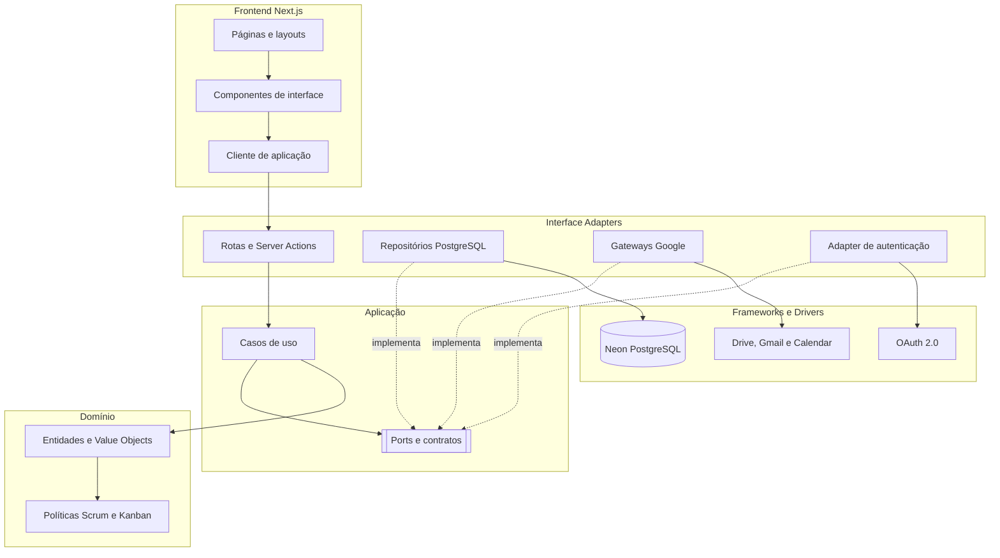
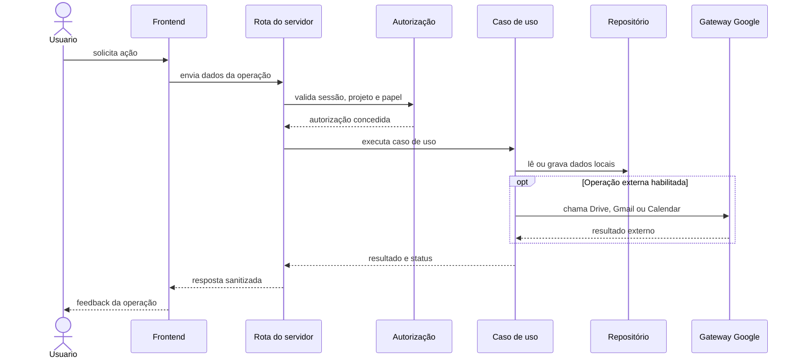

# Arquitetura do Sistema

**Projeto:** Sistema Web de Gestão Ágil do Projeto Acadêmico  
**Versão:** 1.0  
**Status:** proposta arquitetural para validação  
**Base:** Clean Architecture, DDD e requisitos do MVP

## 1. Objetivo e limites

Esta arquitetura organiza o frontend Next.js, o acesso ao Neon/PostgreSQL e as integrações Google sem misturar regras de negócio com detalhes de framework ou infraestrutura.

O frontend é uma camada de apresentação. O servidor é responsável por autenticação, autorização, casos de uso, acesso ao banco e chamadas ao Google Drive, Gmail e Calendar.

## 2. Princípios

- Dependências apontam das camadas externas para as internas.
- `domain` não conhece React, Next.js, ORM, PostgreSQL ou SDK Google.
- `application` orquestra casos de uso por meio de portas.
- `adapters` implementa portas para HTTP, banco, autenticação e Google.
- `infra` contém framework, cliente de banco, SDKs e configurações.
- Autorização é aplicada no servidor em toda leitura sensível e toda escrita.
- Dados locais continuam operacionais quando uma integração Google falha.
- Operações externas possuem status, auditoria, retry controlado e idempotência quando aplicável.
- O domínio não deve modelar o Google como parte obrigatória do funcionamento do projeto.

## 3. Camadas

### 3.1 Domain

Contém entidades, value objects, políticas e invariantes do projeto:

- `Project`, `ProductGoal`, `WorkFront`;
- `Person`, `Pair`, `ProjectMembership`;
- `BacklogItem`, `SprintItem`, `Sprint`;
- `WorkflowColumn`, `Blocker`, `Delivery`, `Deadline`;
- `Attachment`, `Notification`, `CalendarEvent`;
- regras de WIP, transição de fluxo, papéis e estados de sincronização.

Não contém chamadas de rede, consultas SQL, componentes de interface ou tokens.

### 3.2 Application

Contém casos de uso e portas:

- `GetProjectOverviewUseCase`;
- `CreateBacklogItemUseCase`;
- `MoveBacklogItemUseCase`;
- `ManageSprintUseCase`;
- `UploadAttachmentUseCase`;
- `SendNotificationUseCase`;
- `SyncCalendarEventUseCase`.

As portas incluem repositórios, `AuthGateway`, `FileStorageGateway`, `EmailGateway` e `CalendarGateway`.

### 3.3 Interface Adapters

Converte entradas e saídas entre o domínio e as tecnologias:

- rotas `app/api` e Server Actions;
- presenters e DTOs para o frontend;
- repositórios PostgreSQL;
- adapter de autenticação;
- gateways Google;
- normalização de erros e contexto de requisição.

### 3.4 Frameworks e infraestrutura

Contém:

- Next.js e React;
- cliente PostgreSQL/Neon e migrações;
- SDKs Google;
- OAuth 2.0;
- variáveis de ambiente e armazenamento seguro de tokens;
- mecanismos de logs, retry e observabilidade.

## 4. Diagrama de Componentes



## 5. Fluxo de dados e segurança



O navegador nunca recebe tokens OAuth, segredos, credenciais de banco ou detalhes internos de erro. A resposta ao frontend deve conter somente dados necessários para a tela.

## 6. Integrações externas

| Porta | Adapter | Serviço | Regra de falha |
|---|---|---|---|
| `FileStorageGateway` | `GoogleDriveGateway` | Google Drive | manter vínculo pendente ou falha recuperável |
| `EmailGateway` | `GmailGateway` | Gmail | não repetir envio automaticamente sem idempotência |
| `CalendarGateway` | `GoogleCalendarGateway` | Google Calendar | manter agenda interna e marcar sincronização |
| `AuthGateway` | `GoogleAuthAdapter` ou provedor definido | OAuth | negar acesso sem sessão válida |

### 6.1 Google Drive

O servidor resolve a pasta por configuração autorizada. O cliente não escolhe livremente o diretório de destino. O banco guarda metadados e `external_file_id`, não o binário do arquivo.

### 6.2 Gmail

O MVP usa escopo de envio, sem leitura da caixa de entrada. O caso de uso valida destinatários, registra operação pendente antes do envio e grava sucesso ou falha após o retorno do gateway.

### 6.3 Google Calendar

Calendar é opcional. O sistema mantém uma agenda interna para reuniões de terça e quarta, prazos e Sprints. A sincronização externa pode ser habilitada sem tornar o domínio dependente do Google.

## 7. Persistência

A aplicação utiliza Neon como PostgreSQL online. O acesso ao banco fica em repositórios no servidor.

Entidades principais:

- projeto, meta do produto e frentes;
- pessoas, duplas e vínculos com papéis;
- Sprints, backlog e seleção de itens;
- colunas, mudanças de estado, WIP e bloqueios;
- entregas e prazos;
- anexos, notificações e eventos de calendário;
- conexões externas e auditoria.

Regras essenciais:

- UUID para identificadores internos;
- identificadores Google separados dos identificadores internos;
- histórico de mudanças append-only;
- tokens fora das tabelas comuns de domínio;
- arquivamento preferencial em vez de apagar dados históricos;
- índices por projeto, Sprint, frente, estado, prazo e status de integração.

## 8. Segurança e autorização

1. O usuário autentica por um provedor definido na etapa de implementação.
2. O servidor resolve a identidade e o vínculo com o projeto.
3. Cada caso de uso verifica a permissão necessária.
4. Cada gateway usa somente os escopos Google aprovados.
5. Logs não devem registrar tokens, conteúdo sensível ou credenciais.
6. Revogação de conexão deve alterar o estado local da integração.
7. Falhas de autorização retornam erro seguro e não revelam dados de outros projetos.

## 9. Organização no Next.js

A árvore detalhada está em [tree.md](../tree.md). A implementação deve manter estas fronteiras:

```text
app/                 rotas, layouts e páginas
src/domain/          regras e entidades puras
src/application/     casos de uso e portas
src/adapters/        implementações de repositórios e gateways
src/server/          sessão, autorização e configuração segura
db/                  schema, migrações, seeds e cliente Neon
tests/               unitários, aplicação, integração e E2E
```

## 10. Estratégia de testes

- **Domínio:** transições de fluxo, WIP, bloqueios, papéis e estados.
- **Aplicação:** casos de uso com repositórios e gateways fake.
- **Integração:** mapeamento PostgreSQL e contratos dos gateways Google.
- **Frontend:** loading, vazio, erro, acesso negado, sucesso e operação pendente.
- **E2E:** visão geral, atualização no fluxo, upload Drive e envio Gmail.

A implementação deve seguir red → green → refactor e manter rastreabilidade para os requisitos em [requisitos.md](../requisitos/requisitos.md).

## 11. Decisões pendentes

- provedor final de autenticação;
- conta Google responsável pela pasta e pelo envio Gmail;
- `folder_id` do Drive;
- calendário de destino;
- escopos OAuth aprovados;
- mecanismo de fila para operações externas demoradas;
- política de retry e idempotência do Gmail;
- limites de upload;
- política de retenção de auditoria e conteúdo de notificações.
