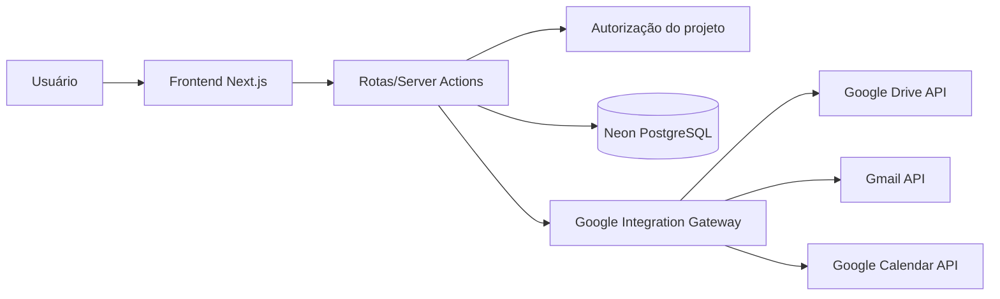
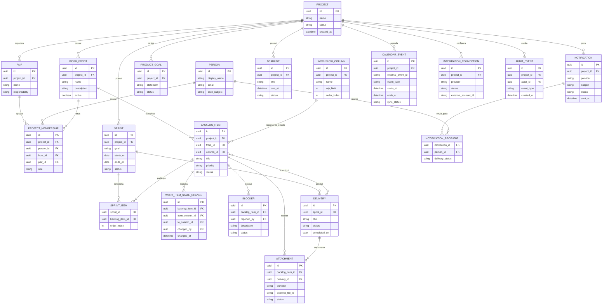
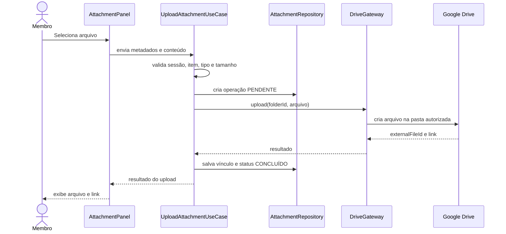
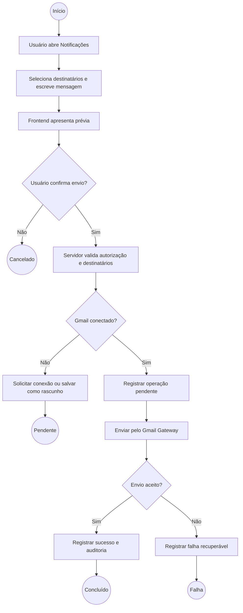
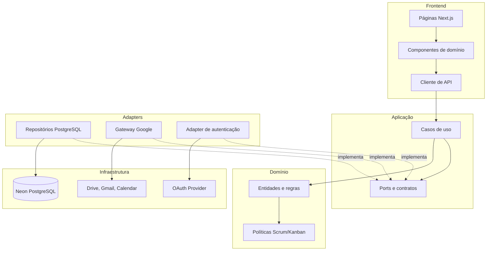

# Especificação Técnica — Frontend, Banco de Dados e Integrações

**Projeto:** Sistema Web de Gestão Ágil do Projeto Acadêmico  
**Versão:** 1.0 — proposta inicial  
**Status:** especificação técnica para validação  
**Escopo desta fase:** frontend, persistência e integrações com Google Drive, Gmail e Google Calendar

## 1. Objetivo

Definir a base técnica do sistema web que apoiará um único projeto acadêmico organizado com Scrum e Kanban. O sistema deverá oferecer transparência sobre metas, backlog, Sprints, fluxo, bloqueios, entregas, pessoas e histórico, além de permitir o uso de serviços Google para arquivos, mensagens e notificações.

Esta especificação detalha a experiência do frontend, o modelo persistente inicial, as fronteiras de segurança e os contratos necessários para integrações externas. Ela não substitui a validação do fluxo real de trabalho nem define ainda todos os detalhes de implementação de componentes.

## 2. Premissas e Decisões

- A aplicação atende inicialmente um único projeto e um único Scrum Team.
- Oito pessoas participam do projeto, organizadas em quatro duplas.
- Uma dupla atua como apoio de Gestão Ágil; uma pessoa exerce a responsabilidade formal de Scrum Master por vez, alternando entre o Scrum Master e o Scrum Master Assistente, ambos com permissões de Administrador Técnico.
- Coordenadores acompanham todos os membros, possuem visão ampliada do projeto e atuam como Product Owner; um deles, por vez, exerce essa responsabilidade.
- As frentes são agrupamentos de trabalho, não Scrum Teams independentes.
- As reuniões presenciais ocorrem às terças e quartas-feiras, das 08:00 às 10:00, exceto feriados.
- A quarta-feira é o principal momento de apresentação de atualizações, andamento e adaptações.
- Scrum estrutura o trabalho; Kanban visualiza e melhora o fluxo.
- O frontend não acessará diretamente o banco nem utilizará segredos de integração.
- O banco será online, utilizando Neon como infraestrutura PostgreSQL.
- A pasta de destino do Google Drive já existe e será identificada por configuração, preferencialmente por `folder_id`.
- A integração com Calendar será opcional no primeiro incremento, mas o domínio deverá comportar lembretes e eventos futuros.
- O chat "PETBSI notificações" no Telegram e o bot serão configurados pelo Scrum Master/Scrum Master Assistente para notificações automáticas de eventos e lembretes de prazo de tarefa (formato "A tarefa X falta Y dias para o prazo final.").

## 3. Atores e Permissões

| Ator | Responsabilidade | Acesso esperado |
|---|---|---|
| Membro da equipe | Executar e atualizar o trabalho | Título padrão "Membro"; exibido como "Visitante" quando não possui permissão de edição; consulta projeto, atualiza itens permitidos, registra bloqueios e participa das Sprints |
| Scrum Master | Apoiar transparência, inspeção, adaptação e facilitação; atuar como Administrador Técnico | Gerenciar fluxo, políticas, bloqueios e eventos; configurar integrações e permissões; não distribuir tarefas como gerente |
| Scrum Master Assistente | Alternar, por período, com o Scrum Master; atuar como Administrador Técnico | Mesmas permissões técnicas do Scrum Master (integrações, configurações e delimitação de permissões) |
| Coordenador (Product Owner) | Supervisionar todos os membros e o andamento do projeto; maximizar valor e ordenar o Product Backlog | Visão ampla, consulta de histórico, acompanhamento de entregas, prazos e notificações; definir Meta do Produto, criar/editar itens e ordenar o Product Backlog |
| Google | Sistema externo | Fornecer OAuth, Drive, Gmail e Calendar conforme escopos consentidos |

### 3.1 Regra de autorização

Autenticação identifica a pessoa. Autorização deriva do vínculo da pessoa com o projeto, da responsabilidade atual e da ação solicitada. Não se deve usar apenas o endereço de e-mail ou uma condição fixa no frontend para decidir permissões.

As permissões devem ser verificadas no servidor em toda operação de escrita e em toda chamada às APIs Google.

## 4. Requisitos Funcionais

| ID | Descrição | Prioridade | Origem |
|---|---|---|---|
| RF01 | O sistema deve autenticar e identificar os participantes autorizados do projeto. | Alta | Segurança e operação |
| RF02 | O sistema deve exibir uma visão geral com Sprint, metas, prazos, bloqueios, WIP e entregas recentes. | Alta | Fase 1 |
| RF03 | O Coordenador (Product Owner atual) deve criar, editar e ordenar itens do Product Backlog. | Alta | Scrum |
| RF04 | A equipe deve selecionar itens para uma Sprint e manter o Sprint Backlog. | Alta | Scrum |
| RF05 | O sistema deve permitir registrar e consultar a Meta da Sprint e a Meta do Produto. | Alta | Scrum |
| RF06 | Membros autorizados devem atualizar o estado real dos itens no fluxo Kanban. | Alta | Kanban |
| RF07 | O sistema deve impedir ou alertar movimentações que violem políticas e limites de WIP configurados. | Alta | Kanban |
| RF08 | Usuários autorizados devem registrar, atualizar, resolver e consultar bloqueios. | Alta | Fluxo |
| RF09 | O sistema deve relacionar cada item a uma frente, Sprint, responsáveis e entregas quando aplicável. | Alta | Fase 1 |
| RF10 | O sistema deve registrar histórico de mudanças relevantes em itens, Sprints, fluxo, bloqueios e integrações. | Alta | Relatórios |
| RF11 | Usuários autorizados devem consultar entregas por frente, Sprint, período e status. | Média | Acompanhamento |
| RF12 | O sistema deve permitir anexar ou enviar um arquivo para o diretório Google Drive configurado. | Alta | Nova integração |
| RF13 | O sistema deve armazenar no sistema o vínculo do arquivo enviado, sem duplicar o conteúdo binário no banco. | Alta | Nova integração |
| RF14 | Usuários autorizados devem redigir uma mensagem de e-mail para membros selecionados. | Média | Nova integração |
| RF15 | O sistema deve permitir enviar notificações por Gmail para eventos autorizados do projeto. | Média | Nova integração |
| RF16 | O sistema deve exibir o resultado, o status e eventual erro de cada operação Google. | Alta | Confiabilidade |
| RF17 | O sistema deve permitir configurar lembretes de reuniões, prazos e eventos relevantes. | Média | Notificações |
| RF18 | O sistema deve criar ou sincronizar evento no Google Calendar quando o recurso estiver habilitado e autorizado. | Baixa/Média | Integração opcional |
| RF19 | O sistema deve permitir desativar Calendar sem impedir o uso do restante do sistema. | Alta | Resiliência |
| RF20 | O sistema deve distinguir as reuniões de terça e quarta e marcar a quarta como reunião principal de acompanhamento. | Alta | Cadência do projeto |
| RF21 | O sistema deve notificar eventos e prazos de tarefas no chat "PETBSI notificações" do Telegram, por meio de bot, incluindo mensagens como "A tarefa X falta Y dias para o prazo final.", registrando o resultado de cada envio. | Média | Nova integração |

## 5. Requisitos Não Funcionais

| ID | Categoria | Critério |
|---|---|---|
| RNF01 | Segurança | Tokens, segredos e credenciais Google nunca podem ser enviados ao navegador ou persistidos em texto puro. |
| RNF02 | Segurança | A API deve solicitar apenas os escopos Google necessários para cada recurso e exigir consentimento adequado. |
| RNF03 | Segurança | Toda operação de escrita deve validar sessão, projeto, papel e autorização no servidor. |
| RNF04 | Privacidade | O sistema deve registrar somente dados Google necessários à finalidade do projeto e permitir revogar a conexão. |
| RNF05 | Disponibilidade | Falha temporária de Drive, Gmail ou Calendar não deve impedir consulta e atualização dos dados locais. |
| RNF06 | Confiabilidade | Uploads, envio de e-mail e sincronização devem possuir estado explícito, idempotência quando aplicável e mensagem de erro compreensível. |
| RNF07 | Desempenho | A visão geral deve apresentar o conteúdo local principal em até 2 segundos em condições normais de rede, sem aguardar APIs Google não essenciais. |
| RNF08 | Usabilidade | O frontend deve indicar claramente carregamento, sucesso, falha, ação pendente e dados desatualizados. |
| RNF09 | Acessibilidade | As telas principais devem ser navegáveis por teclado, possuir foco visível, contraste adequado e rótulos para leitores de tela. |
| RNF10 | Responsividade | As áreas de acompanhamento devem funcionar em desktop e telas menores sem ocultar estado, responsável ou bloqueio. |
| RNF11 | Auditoria | Mudanças de permissão, envio, upload, exclusão de vínculo e alteração de fluxo devem gerar evento de auditoria. |
| RNF12 | Manutenibilidade | Regras de domínio e casos de uso não devem depender de componentes React, ORM ou SDK Google. |
| RNF13 | Portabilidade | A integração Google deve ser encapsulada atrás de interfaces para permitir troca de provedor ou implementação fake em testes. |
| RNF14 | Acessibilidade/Usabilidade | O frontend deve oferecer alternância entre tema claro e escuro, disponível em todas as telas, inclusive na tela de login, persistindo a preferência do usuário. |

## 6. Escopo do Frontend

### 6.1 Navegação principal

```text
Projeto
├── Visão geral
├── Produto e objetivos
├── Product Backlog
├── Sprint atual
│   ├── Meta da Sprint
│   ├── Sprint Backlog
│   └── Fluxo Kanban
├── Frentes
├── Entregas e histórico
├── Arquivos
├── Notificações
├── Agenda
└── Pessoas e responsabilidades
```

### 6.2 Telas e responsabilidades

| Tela | Conteúdo principal | Ações |
|---|---|---|
| Visão geral | Meta, Sprint, indicadores, reuniões, bloqueios e entregas | Acessar detalhes e filtrar por frente |
| Product Backlog | Itens ordenáveis, tipo, valor, prioridade, frente e estado | Criar, editar, ordenar e consultar |
| Sprint | Meta, itens selecionados, progresso e definição de pronto | Planejar, adaptar e encerrar Sprint |
| Fluxo Kanban | Colunas derivadas do fluxo, WIP, bloqueios e políticas | Mover item, registrar bloqueio e consultar política |
| Detalhe do item | Descrição, responsáveis, frente, histórico, arquivos e comentários | Editar campos permitidos, anexar arquivo e notificar |
| Entregas e histórico | Resultados por período, Sprint, frente e status | Consultar e exportar posteriormente, se aprovado |
| Arquivos | Vínculos com arquivos no Drive e estado dos uploads | Enviar, abrir no Drive e consultar operação |
| Notificações | Destinatários, assunto, mensagem, prévia e histórico de envio | Redigir, revisar e enviar e-mail |
| Agenda | Reuniões, prazos e eventos sincronizados | Criar lembrete e sincronizar Calendar quando habilitado |
| Pessoas | Participantes, duplas, frentes e responsabilidades | Consultar; editar somente conforme permissão |
| Configurações | Integrações, políticas, horários, feriados e permissões | Configurar recursos administrativos |

### 6.3 Estados obrigatórios da interface

Toda tela que depender de dados locais ou externos deve possuir estados de carregamento, vazio, sucesso, erro recuperável, sem autorização e acesso negado. Operações demoradas devem mostrar progresso e impedir duplicação acidental do comando.

O frontend deverá usar atualização otimista somente para alterações locais reversíveis. Upload, envio de e-mail e criação de evento devem confirmar o resultado no servidor antes de apresentar a operação como concluída.

Todas as telas, incluindo a tela de login, devem oferecer um controle de alternância entre tema claro e escuro (RNF14). A preferência deve ser persistida no navegador e aplicada antes da primeira pintura para evitar mudança brusca de aparência, respeitando o tema do sistema como padrão quando o usuário ainda não escolheu.

## 7. Integrações Google

### 7.1 Arquitetura de integração



O frontend conversa apenas com a aplicação. O gateway de integração deve concentrar OAuth, tokens, retries, mapeamento de erros e chamadas Google. O domínio conhece portas como `FileStorageGateway`, `EmailGateway` e `CalendarGateway`, e não conhece SDKs Google.

### 7.2 OAuth e escopos

O fluxo recomendado é OAuth 2.0 com consentimento explícito e tokens mantidos no servidor. A aplicação deve separar conexão da conta Google e autorização das ações do projeto.

Escopos devem ser escolhidos pelo menor privilégio possível. A proposta inicial é:

- Drive: escopo restrito ao uso necessário para criar arquivos na pasta configurada, evitando acesso amplo ao Drive sempre que a política e o tipo de aplicação permitirem.
- Gmail: escopo de envio somente, sem leitura da caixa de entrada, para o caso de uso de notificações.
- Calendar: escopo de criação/edição apenas no calendário selecionado, caso essa integração seja ativada.

Os escopos finais dependem da política atual das APIs Google e do tipo de consentimento configurado. A revisão de segurança deverá ocorrer antes da implementação.

### 7.3 Google Drive

#### Fluxo de upload

1. Usuário abre um item ou a área de Arquivos.
2. Frontend envia metadados e arquivo para a aplicação.
3. Servidor valida tamanho, tipo, permissão, projeto e associação ao item.
4. Gateway cria o arquivo dentro do `folder_id` configurado.
5. Servidor salva somente metadados e o identificador Google do arquivo.
6. Frontend atualiza a lista e oferece link para abertura no Drive.

#### Dados armazenados localmente

- identificador do arquivo no Google;
- nome, MIME type, tamanho e URL de visualização;
- pasta de destino lógica;
- item, entrega ou Sprint relacionada;
- usuário que iniciou o envio;
- status da operação;
- timestamps e erro técnico sanitizado, quando houver.

O conteúdo binário não deve ser salvo no banco. Arquivos não devem ser enviados para uma pasta arbitrária informada pelo cliente; o destino deve ser resolvido no servidor a partir da configuração autorizada.

### 7.4 Gmail

#### Fluxo de notificação

1. Usuário autorizado escolhe destinatários do projeto ou um grupo permitido.
2. Frontend apresenta formulário com assunto, mensagem, contexto e prévia.
3. Servidor valida destinatários, conteúdo, autorização e política de envio.
4. Gateway envia a mensagem via Gmail.
5. Sistema registra a solicitação, resultado, remetente, destinatários, data e referência técnica do envio.
6. Frontend exibe sucesso ou erro recuperável.

O MVP deve evitar envio automático indiscriminado. Notificações automáticas devem nascer de eventos explícitos, possuir deduplicação e respeitar limites de envio. O sistema não deve armazenar conteúdo sensível desnecessário além do necessário para auditoria e histórico.

### 7.5 Google Calendar

Calendar é uma integração recomendada para lembretes de reuniões, Sprints, prazos e eventos de acompanhamento. Ela deve ser desacoplada e opcional.

Eventos candidatos:

- reunião de terça-feira;
- reunião principal de quarta-feira;
- prazo de entrega;
- início e encerramento de Sprint;
- lembrete de item bloqueado ou revisão.

Cada evento sincronizado deve guardar o `external_event_id`, calendário de destino, última sincronização, estado e versão local. A ausência de autorização ou uma falha no Calendar não deve impedir o funcionamento do calendário interno do sistema.

## 8. Modelo de Dados

### 8.1 Entidades persistentes

| Entidade | Finalidade |
|---|---|
| `Project` | Representar o projeto acadêmico |
| `ProductGoal` | Registrar a Meta do Produto |
| `WorkFront` | Representar as quatro frentes |
| `Person` | Identificar participante ou coordenador |
| `ProjectMembership` | Associar pessoa, projeto, frente, dupla e papel |
| `Pair` | Representar uma dupla de trabalho |
| `Sprint` | Registrar período, objetivo e estado da Sprint |
| `BacklogItem` | Representar item do Product Backlog |
| `SprintItem` | Associar item selecionado ao Sprint Backlog |
| `WorkflowColumn` | Configurar estados reais do fluxo |
| `WorkItemStateChange` | Registrar movimentações no fluxo |
| `Blocker` | Registrar impedimento, responsável e resolução |
| `Delivery` | Representar resultado verificável do projeto |
| `Deadline` | Registrar prazo acadêmico ou operacional |
| `Attachment` | Vincular arquivo externo do Drive ao domínio |
| `Notification` | Registrar mensagem ou notificação solicitada |
| `NotificationRecipient` | Registrar destinatários de uma notificação |
| `CalendarEvent` | Vincular evento local a evento Google opcional |
| `IntegrationConnection` | Registrar conexão e configuração não secreta do provedor |
| `AuditEvent` | Registrar mudança relevante e operação externa |

### 8.2 Diagrama entidade-relacionamento



### 8.3 Regras de persistência

- Identificadores internos devem ser UUIDs; identificadores externos Google devem ser armazenados separadamente.
- E-mail não deve ser a chave primária de uma pessoa.
- `ProjectMembership` deve permitir que papel, frente e dupla mudem sem apagar o histórico.
- `BacklogItem` e `SprintItem` são conceitos distintos: seleção para uma Sprint não altera a identidade do item do Product Backlog.
- Mudanças de estado devem ser append-only em `WorkItemStateChange`; o estado atual pode ser materializado em `BacklogItem` para consulta rápida.
- Tokens OAuth não devem estar em tabelas de domínio comuns. Se forem persistidos, devem usar armazenamento secreto/criptografia gerenciada e acesso mínimo.
- Índices devem cobrir projeto, Sprint, frente, estado, prazo, status de integração e timestamps de auditoria.
- Exclusões de registros com valor histórico devem ser substituídas por arquivamento ou desativação quando a regra de negócio permitir.

## 9. Casos de Uso Técnicos

### UC01 — Consultar visão geral

**Ator:** qualquer membro autorizado, coordenador ou Scrum Master com acesso.  
**Pré-condição:** sessão válida e vínculo com o projeto.  
**Fluxo:** o frontend solicita dados locais agregados; servidor aplica autorização; banco retorna Sprint, metas, bloqueios, WIP, prazos e entregas; frontend apresenta os estados.  
**Pós-condição:** nenhuma alteração persistente.

### UC02 — Atualizar item no fluxo

**Ator:** membro autorizado ou Scrum Master/Scrum Master Assistente.  
**Pré-condição:** item pertence ao projeto e a movimentação respeita política e WIP, ou possui autorização explícita para exceção.  
**Fluxo alternativo:** se o limite for atingido, o servidor rejeita ou exige confirmação conforme política; o frontend mantém o item no estado anterior e informa o motivo.  
**Pós-condição:** estado atual e histórico são atualizados atomicamente.

### UC03 — Enviar arquivo ao Drive

**Ator:** membro autorizado.  
**Pré-condição:** conexão Drive ativa e pasta configurada.  
**Fluxo:** validar arquivo; criar operação pendente; enviar ao gateway; criar arquivo na pasta autorizada; persistir vínculo; atualizar interface.  
**Pós-condição:** arquivo acessível no Drive e vinculado a item ou entrega.

### UC04 — Enviar notificação por Gmail

**Ator:** coordenador, Scrum Master/Scrum Master Assistente ou outro papel autorizado.  
**Pré-condição:** conexão Gmail ativa e destinatários permitidos.  
**Fluxo:** redigir; revisar; confirmar; enviar no servidor; registrar status e auditoria.  
**Pós-condição:** mensagem enviada ou operação marcada como falha recuperável.

### UC05 — Sincronizar evento com Calendar

**Ator:** sistema ou usuário autorizado.  
**Pré-condição:** Calendar habilitado e calendário de destino selecionado.  
**Fluxo:** criar ou atualizar evento externo; persistir identificador e resultado; manter evento interno mesmo em caso de falha.  
**Pós-condição:** evento local possui estado de sincronização conhecido.

### UC06 — Notificar eventos e prazos no Telegram

**Ator:** sistema, agendador ou usuário autorizado.  
**Pré-condição:** chat "PETBSI notificações" e bot configurados; evento ou lembrete de prazo habilitado.  
**Fluxo:** gerar mensagem a partir de evento ou de prazo de tarefa ("A tarefa X falta Y dias para o prazo final."); enviar ao chat via bot; registrar status e auditoria.  
**Pós-condição:** mensagem enviada ou operação marcada como pendente/falha recuperável.

## 10. Classes de Fronteira, Controle e Entidade

| Caso de uso | Boundary | Control | Entidades principais |
|---|---|---|---|
| Consultar visão geral | `ProjectOverviewPage` | `GetProjectOverviewUseCase` | `Project`, `Sprint`, `BacklogItem`, `Blocker`, `Delivery` |
| Atualizar item no fluxo | `WorkflowBoard` | `MoveBacklogItemUseCase` | `BacklogItem`, `WorkflowColumn`, `WorkItemStateChange` |
| Enviar arquivo ao Drive | `AttachmentPanel` | `UploadAttachmentUseCase` | `Attachment`, `BacklogItem`, `Delivery` |
| Enviar notificação Gmail | `NotificationComposer` | `SendNotificationUseCase` | `Notification`, `NotificationRecipient`, `ProjectMembership` |
| Sincronizar Calendar | `CalendarSettings` | `SyncCalendarEventUseCase` | `CalendarEvent`, `Deadline`, `Sprint` |
| Notificar eventos e prazos no Telegram | `TelegramNotifyRoute`/`Agendador` | `SendTelegramMessageUseCase` | `TelegramMessage`, `Project`, `Deadline`, `BacklogItem` |

## 11. Sequência de Upload para o Drive



## 12. Atividade de Notificação



## 13. Componentes e Camadas



Regra de dependência: domínio e aplicação não importam React, Next.js, ORM, SDK Google ou detalhes de infraestrutura. O frontend é uma camada de entrada; autorização e regras continuam no servidor.

## 14. DDD e Clean Architecture

### Aggregates iniciais

| Aggregate Root | Conteúdo | Repository |
|---|---|---|
| `Project` | metas, frentes, participantes e configurações | `ProjectRepository` |
| `Sprint` | Meta da Sprint e seleção de itens | `SprintRepository` |
| `BacklogItem` | estado, responsáveis, bloqueios e mudanças | `BacklogItemRepository` |
| `Delivery` | resultado, vínculos e arquivos | `DeliveryRepository` |
| `Notification` | mensagem, destinatários e resultado | `NotificationRepository` |
| `CalendarEvent` | evento local e sincronização externa | `CalendarEventRepository` |

### Value Objects candidatos

- `ProjectRole`;
- `WorkItemStatus`;
- `WorkflowPolicy`;
- `WipLimit`;
- `EmailAddress`;
- `ExternalFileReference`;
- `NotificationStatus`;
- `SyncStatus`;
- intervalo de datas da Sprint e do evento.

### Portas externas

```text
FileStorageGateway
  upload(file, destination) -> ExternalFileReference

EmailGateway
  send(message) -> DeliveryResult

CalendarGateway
  createOrUpdate(event) -> ExternalEventReference

AuthGateway
  getCurrentUser() -> AuthenticatedUser
```

## 15. Estratégia de Testes

O desenvolvimento deve seguir TDD de dentro para fora:

1. Testar políticas de WIP, transições de fluxo e regras de autorização no domínio.
2. Testar casos de uso com repositórios em memória e gateways fake.
3. Testar repositórios contra banco de teste.
4. Testar adapters Google com contratos, mocks/fakes e testes de integração controlados.
5. Testar fluxos críticos do frontend, incluindo estados de carregamento, erro, retry e acesso negado.

Testes mínimos por integração:

| Área | Casos essenciais |
|---|---|
| Drive | pasta correta, arquivo aceito, tipo/tamanho inválido, token ausente, retry e duplicação |
| Gmail | destinatários autorizados, conteúdo validado, envio único, falha externa e auditoria |
| Calendar | criação, atualização idempotente, desconexão e preservação do evento local |
| Autorização | membro, Scrum Master/Scrum Master Assistente, coordenador (Product Owner) e acesso negado |
| Frontend | loading, vazio, erro recuperável, sucesso, operação pendente e responsividade |

Cada requisito funcional deve ser rastreável a pelo menos um caso de uso e a um teste de aceitação.

## 16. Decisões Pendentes

- Provedor e estratégia final de autenticação da aplicação.
- Conta Google que será dona ou administradora da pasta de destino.
- `folder_id` e regras de compartilhamento do diretório existente.
- Usuário remetente autorizado para Gmail e política de envio automático.
- Calendário de destino e se os eventos serão criados por conta individual ou conta institucional.
- Escopos OAuth aprovados e necessidade de verificação da aplicação Google.
- Limites de tamanho e tipos de arquivo aceitos.
- Política de retenção do conteúdo de e-mails e dos logs de integração.
- Duração das Sprints, estados definitivos do fluxo e limites de WIP.
- Necessidade de rascunhos, fila assíncrona e processamento por worker para operações Google.
- Regras de feriados e calendário acadêmico.

## 17. Relação com Outros Documentos

- [Roteiro do projeto](roteiro.md)
- [Backlog inicial](backlog/backlog.md)
- [Especificação de software](especificao-de-software/01-visao-produto.md)
- [README do projeto](../README.md)
- [Documento de encerramento da Fase 1](fase-1-exploracao-ideias.md)
- [Guia Kanban](sources/guiaKanban.pdf)
- [Guia Scrum](sources/guiaScrum.pdf)