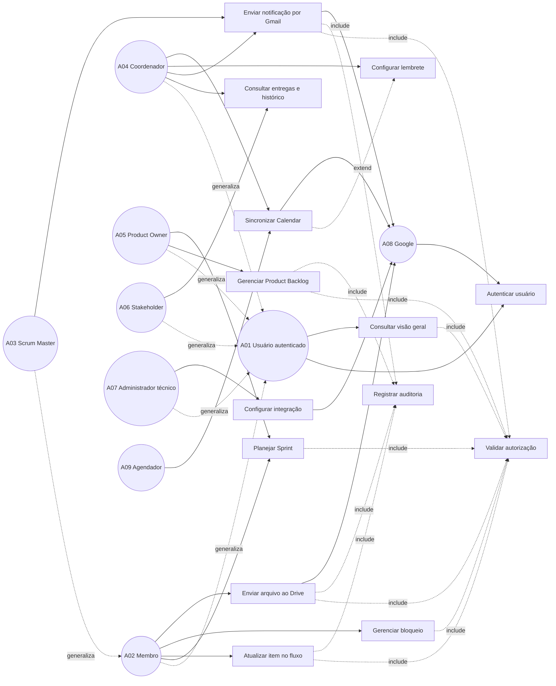

# 03 — Casos de Uso

**Projeto:** Sistema Web de Gestão Ágil do Projeto Acadêmico  
**Versão:** 1.0  
**Status:** proposta para validação  
**Origem:** [02 — Requisitos](02-requisitos.md)

## 1. Objetivo

Detalhar as interações entre os atores e o sistema, transformando os requisitos funcionais em capacidades observáveis. Cada caso de uso deverá orientar o modelo de domínio, os diagramas de sequência, as telas e os testes de aceitação.

## 2. Atores

| ID | Ator | Papel no caso de uso |
|---|---|---|
| A01 | Usuário autenticado | Acessa informações permitidas do projeto |
| A02 | Membro da equipe | Consulta e atualiza trabalho |
| A03 | Scrum Master | Apoia fluxo, políticas, bloqueios e eventos |
| A04 | Coordenador | Acompanha todos os membros, prazos e resultados |
| A05 | Product Owner | Define metas e ordena o Product Backlog |
| A06 | Professor/Stakeholder | Consulta resultados e fornece feedback |
| A07 | Administrador técnico | Configura integrações e parâmetros técnicos |
| A08 | Google | Executa OAuth, armazenamento, envio e agenda externos |
| A09 | Agendador | Dispara lembretes e sincronizações programadas |

## 3. Diagrama geral de casos de uso

`include` indica comportamento obrigatório para completar o caso base. `extend` indica comportamento opcional, condicionado à habilitação do Calendar.

## 4. Catálogo de casos de uso

| ID | Caso de uso | Ator principal | Requisitos |
|---|---|---|---|
| UC01 | Autenticar usuário | A01 | RF01, RNF01-RNF03 |
| UC02 | Consultar visão geral | A01/A02 | RF02, RF09, RF11 |
| UC03 | Gerenciar Product Backlog | A05 | RF03, RNF02 |
| UC04 | Planejar Sprint | A02/A05 | RF04-RF05, RNF02 |
| UC05 | Atualizar item no fluxo | A02/A03 | RF06-RF07, RF10, RN01-RN05 |
| UC06 | Gerenciar bloqueio | A02/A03 | RF08, RF10 |
| UC07 | Consultar entregas e histórico | A04/A06 | RF10-RF11 |
| UC08 | Enviar arquivo ao Drive | A02 | RF12-RF13, RF16, RNF01-RNF05 |
| UC09 | Enviar notificação por Gmail | A04/A03 | RF14-RF16, RNF01-RNF05 |
| UC10 | Configurar lembrete | A04 | RF17, RF20 |
| UC11 | Sincronizar Calendar | A04/A09 | RF18-RF20, RN07-RN08 |
| UC12 | Configurar integração | A07 | RF01, RF16, RNF01-RNF03 |

## 5. Especificação dos casos principais

### UC01 — Autenticar usuário

- **Ator:** A01.
- **Pré-condição:** provedor de autenticação configurado.
- **Fluxo principal:** usuário inicia login; provedor autentica; sistema identifica a pessoa; sistema verifica vínculo com o projeto; sessão é criada.
- **Alternativas:** credenciais inválidas, usuário sem vínculo ou sessão expirada impedem acesso e não revelam dados internos.
- **Pós-condição:** usuário possui sessão válida e contexto de autorização.

### UC02 — Consultar visão geral

- **Ator:** A01, A02, A04 ou A06.
- **Pré-condição:** sessão válida e vínculo autorizado.
- **Fluxo principal:** sistema consulta metas, Sprint, prazos, WIP, bloqueios e entregas; frontend apresenta os dados locais.
- **Alternativas:** ausência de dados apresenta estado vazio; indisponibilidade Google não bloqueia a consulta local.
- **Pós-condição:** nenhuma alteração persistente.

### UC03 — Gerenciar Product Backlog

- **Ator:** A05.
- **Pré-condição:** usuário possui responsabilidade de Product Owner.
- **Fluxo principal:** Product Owner cria ou edita item; informa título, descrição, frente e prioridade; sistema valida; sistema salva e registra auditoria; Product Owner ordena os itens.
- **Alternativas:** dados inválidos ou permissão insuficiente impedem a operação.
- **Pós-condição:** Product Backlog fica compreensível, ordenado e auditável.

### UC04 — Planejar Sprint

- **Ator:** A02 e A05.
- **Pré-condição:** Sprint aberta para planejamento e Product Backlog disponível.
- **Fluxo principal:** equipe inspeciona itens; seleciona trabalho; registra Meta da Sprint; sistema cria/atualiza Sprint Backlog.
- **Alternativas:** item incompatível, Sprint encerrada ou falta de autorização impedem a seleção.
- **Pós-condição:** Sprint possui meta e plano de trabalho registrados.

### UC05 — Atualizar item no fluxo

- **Ator:** A02 ou A03.
- **Pré-condição:** item pertence ao projeto e o usuário está autorizado.
- **Fluxo principal:** usuário solicita movimentação; sistema valida estado permitido, política e WIP; grava novo estado e histórico; frontend confirma o resultado.
- **Alternativas:** WIP excedido ou transição proibida mantém o estado anterior e apresenta o motivo.
- **Pós-condição:** estado atual e histórico são consistentes.

### UC06 — Gerenciar bloqueio

- **Ator:** A02 ou A03.
- **Pré-condição:** item existe e usuário possui acesso.
- **Fluxo principal:** usuário registra descrição, impacto e responsável; sistema marca bloqueio; usuário autorizado atualiza ou resolve; sistema registra histórico.
- **Alternativas:** bloqueio sem descrição ou item inexistente é rejeitado.
- **Pós-condição:** bloqueio aberto ou resolvido fica visível no contexto do item.

### UC07 — Consultar entregas e histórico

- **Ator:** A04 ou A06.
- **Pré-condição:** usuário possui permissão de consulta.
- **Fluxo principal:** usuário filtra por frente, Sprint, período ou status; sistema retorna entregas e eventos históricos.
- **Alternativas:** nenhum resultado apresenta estado vazio sem erro.
- **Pós-condição:** nenhuma alteração persistente.

### UC08 — Enviar arquivo ao Drive

- **Ator:** A02.
- **Pré-condição:** conexão Drive ativa, pasta configurada e arquivo dentro dos limites.
- **Fluxo principal:** usuário seleciona arquivo; servidor valida; gateway envia para a pasta autorizada; sistema salva metadados e vínculo; frontend exibe link e status.
- **Alternativas:** conexão indisponível gera pendência/falha recuperável; arquivo inválido é rejeitado antes do envio.
- **Pós-condição:** arquivo externo fica vinculado a item, Sprint ou entrega sem duplicação binária no banco.

### UC09 — Enviar notificação por Gmail

- **Ator:** A04 ou A03.
- **Pré-condição:** conexão Gmail ativa e destinatários permitidos.
- **Fluxo principal:** usuário seleciona destinatários; redige mensagem; revisa prévia; confirma; servidor envia; sistema registra resultado e auditoria.
- **Alternativas:** envio falha ou conexão está ausente; operação recebe estado pendente/falha sem afirmar sucesso.
- **Pós-condição:** mensagem enviada ou operação registrada como não enviada.

### UC10 — Configurar lembrete

- **Ator:** A04.
- **Pré-condição:** usuário possui permissão e evento local é válido.
- **Fluxo principal:** coordenador define evento, data, horário, destinatários e regra de lembrete; sistema salva configuração.
- **Alternativas:** feriado, data inválida ou destinatário não autorizado exigem correção.
- **Pós-condição:** lembrete fica disponível na agenda interna.

### UC11 — Sincronizar Calendar

- **Ator:** A04 ou A09.
- **Pré-condição:** Calendar habilitado e calendário de destino autorizado.
- **Fluxo principal:** sistema cria ou atualiza evento; salva identificador externo e estado de sincronização.
- **Alternativas:** integração desabilitada ou indisponível preserva evento interno e registra falha.
- **Pós-condição:** evento local possui sincronização conhecida.

### UC12 — Configurar integração

- **Ator:** A07.
- **Pré-condição:** administrador autenticado e configuração disponível.
- **Fluxo principal:** administrador conecta/revoga provedor, informa pasta Drive ou calendário, valida conexão e salva apenas configuração não secreta no domínio.
- **Alternativas:** escopo recusado ou configuração inválida mantém integração desabilitada.
- **Pós-condição:** integração fica ativa, pendente ou revogada com status explícito.

## 6. Rastreabilidade

| Caso de uso | Requisitos cobertos | Próximo artefato |
|---|---|---|
| UC01 | RF01, RNF01-RNF03 | sequência de autenticação e testes |
| UC02 | RF02, RF09, RF11 | boundary e sequência de consulta |
| UC03 | RF03, RNF02, RNF10 | classes de backlog |
| UC04 | RF04-RF05 | classes de Sprint |
| UC05-UC06 | RF06-RF08, RF10, RN01-RN05 | estados de item e fluxo |
| UC07 | RF10-RF11 | persistência de histórico |
| UC08 | RF12-RF13, RF16 | sequência Drive e gateway |
| UC09 | RF14-RF16 | sequência Gmail e gateway |
| UC10-UC11 | RF17-RF20, RN07-RN08 | estados e atividade de agenda |
| UC12 | RF01, RF16, RNF01-RNF03 | arquitetura e segurança |
