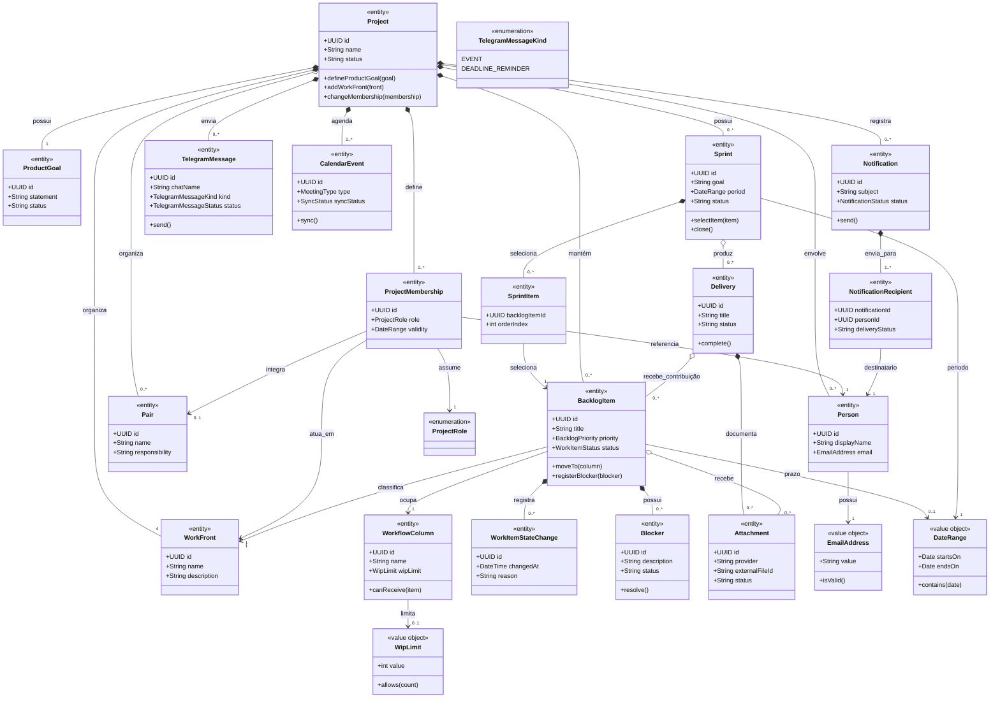
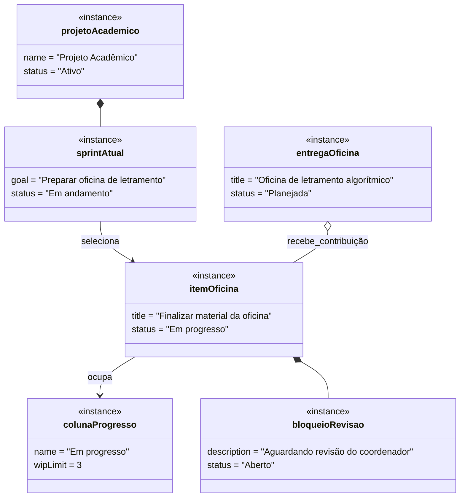

# 04 — Modelo de Domínio

**Projeto:** Sistema Web de Gestão Ágil do Projeto Acadêmico  
**Versão:** 1.0  
**Status:** proposta para validação  
**Origem:** [02 — Requisitos](02-requisitos.md) e [03 — Casos de Uso](03-casos-de-uso.md)

## 1. Objetivo

Definir as entidades, value objects, agregados e relacionamentos centrais do domínio. O modelo representa o projeto acadêmico e seu sistema de trabalho, não apenas uma lista genérica de tarefas.

## 2. Entidades e responsabilidades

| Entidade | Responsabilidade | Persistente |
|---|---|---|
| `Project` | Representar o projeto acadêmico e suas configurações | Sim |
| `ProductGoal` | Representar a Meta do Produto | Sim |
| `WorkFront` | Representar uma das quatro frentes | Sim |
| `Person` | Identificar participante do projeto | Sim |
| `Pair` | Representar uma dupla de trabalho | Sim |
| `ProjectMembership` | Relacionar pessoa, projeto, frente, dupla e papel | Sim |
| `Sprint` | Representar período, Meta da Sprint e estado | Sim |
| `BacklogItem` | Representar item do Product Backlog | Sim |
| `SprintItem` | Representar a seleção de item para uma Sprint | Sim |
| `WorkflowColumn` | Representar estado do fluxo e limite de WIP | Sim |
| `WorkItemStateChange` | Registrar mudança de estado | Sim |
| `Blocker` | Representar impedimento e resolução | Sim |
| `Delivery` | Representar resultado verificável | Sim |
| `Deadline` | Representar prazo acadêmico, operacional ou de tarefa | Sim |
| `Attachment` | Vincular arquivo externo ao domínio | Sim |
| `Notification` | Representar solicitação e resultado de envio (Gmail) | Sim |
| `TelegramMessage` | Representar notificação ou lembrete de prazo enviado ao chat "PETBSI notificações" do Telegram | Sim |
| `CalendarEvent` | Representar evento local e sincronização externa | Sim |
| `IntegrationConnection` | Representar estado de conexão de provedor | Sim |
| `AuditEvent` | Registrar operação relevante | Sim |

## 3. Value Objects e enumerações

| Tipo | Uso |
|---|---|
| `ProjectRole` | `MEMBER`, `SCRUM_MASTER`, `SCRUM_MASTER_ASSISTANT`, `COORDINATOR`, `PRODUCT_OWNER`; o título "Visitante" deriva de um membro sem permissão de edição |
| `BacklogPriority` | Ordenação do Product Backlog |
| `WorkItemStatus` | Estado atual do item no fluxo |
| `WorkflowPolicy` | Critérios de entrada, saída e movimentação |
| `WipLimit` | Capacidade máxima configurada para uma coluna |
| `EmailAddress` | Validação de destinatários |
| `ExternalFileReference` | Provedor, identificador e URL do arquivo |
| `NotificationStatus` | `PENDING`, `SENT`, `FAILED`, `CANCELLED` |
| `TelegramMessageStatus` | `PENDING`, `SENT`, `FAILED`, `CANCELLED` |
| `TelegramMessageKind` | `EVENT`, `DEADLINE_REMINDER` |
| `SyncStatus` | `DISABLED`, `PENDING`, `SYNCED`, `FAILED`, `REVOKED` |
| `MeetingType` | Reunião de terça, reunião principal de quarta ou outro evento |
| `DateRange` | Período da Sprint ou do evento |

Value objects não possuem identidade própria e não devem virar tabelas independentes sem justificativa.

## 4. Agregados

| Aggregate Root | Objetos internos | Regra de consistência |
|---|---|---|
| `Project` | `ProductGoal`, `WorkFront`, `ProjectMembership`, `Pair` | pessoa, frente, dupla e papel pertencem ao contexto do projeto |
| `Sprint` | `SprintItem` e Meta da Sprint | seleção e objetivo devem pertencer à Sprint |
| `BacklogItem` | `Blocker`, mudanças de estado e vínculos de responsáveis | transição e bloqueio devem respeitar políticas |
| `Delivery` | vínculos de item e `Attachment` | entrega deve possuir contexto e estado verificável |
| `Notification` | destinatários e resultado de envio | destinatários e status devem ser auditáveis |
| `CalendarEvent` | configuração de sincronização | evento local permanece válido sem Google |

Um agregado deve ser alterado por sua raiz. Por exemplo, `SprintItem` não deve ser editado diretamente sem passar por `Sprint`.

## 5. Diagrama de classes

### 5.1 Relações principais

- **Composição:** `Project` compõe metas, frentes, vínculos e Sprints; `Sprint` compõe itens selecionados; `BacklogItem` compõe bloqueios e mudanças de estado.
- **Agregação:** `Project` agrega pessoas e duplas, pois elas podem existir fora deste projeto; `Sprint` agrega entregas, pois uma entrega pode ser consultada no histórico.
- **Associação:** itens relacionam-se a frentes, colunas, entregas e arquivos sem assumir posse exclusiva em todos os casos.
- **Herança de atores:** no diagrama de casos de uso, `Membro` especializa o usuário autenticado; `Scrum Master`, `Scrum Master Assistente` e `Coordenador` especializam `Membro`. Não é necessário duplicar pessoas no banco por papel; a permissão por frente deriva do vínculo de `ProjectMembership`. O `Product Owner` é uma responsabilidade exercida por um coordenador por vez, com alternância análoga à do Scrum Master.

## 6. Persistência

| Entidade | Tabela sugerida | Chave principal | Observação |
|---|---|---|---|
| `Project` | `projects` | `id` | raiz do contexto |
| `ProductGoal` | `product_goals` | `id` | FK para projeto |
| `WorkFront` | `work_fronts` | `id` | quatro registros iniciais |
| `Person` | `people` | `id` | e-mail não é PK |
| `ProjectMembership` | `project_memberships` | `id` | papel, frente e dupla |
| `Pair` | `pairs` | `id` | dupla pode ter histórico |
| `Sprint` | `sprints` | `id` | período e estado |
| `BacklogItem` | `backlog_items` | `id` | Product Backlog |
| `SprintItem` | `sprint_items` | `(sprint_id, backlog_item_id)` | tabela associativa |
| `WorkflowColumn` | `workflow_columns` | `id` | WIP e ordenação |
| `WorkItemStateChange` | `work_item_state_changes` | `id` | histórico append-only |
| `Blocker` | `blockers` | `id` | impedimentos |
| `Delivery` | `deliveries` | `id` | resultados verificáveis |
| `Attachment` | `attachments` | `id` | apenas metadados Google |
| `Notification` | `notifications` | `id` | status e auditoria |
| `NotificationRecipient` | `notification_recipients` | `(notification_id, person_id)` | destinatários |
| `TelegramMessage` | `telegram_messages` | `id` | chat "PETBSI notificações", kind e status do envio |
| `CalendarEvent` | `calendar_events` | `id` | vínculo externo opcional |
| `IntegrationConnection` | `integration_connections` | `id` | nunca guardar token puro |
| `AuditEvent` | `audit_events` | `id` | trilha de operações |

## 7. Snapshot de objetos

O snapshot exemplifica que um item selecionado pertence à Sprint atual, ocupa uma coluna do fluxo, pode possuir bloqueio e contribuir para uma entrega.

## 8. Decisões pendentes

- estados definitivos do ciclo de vida de `BacklogItem`, `Sprint` e `CalendarEvent`;
- possibilidade de um item contribuir para várias entregas;
- política de exclusão ou arquivamento de entidades;
- ORM e convenções definitivas de migração;
- necessidade de separar `Delivery` em agregado próprio ou mantê-la vinculada à Sprint;
- regras para múltiplos responsáveis em um item.
