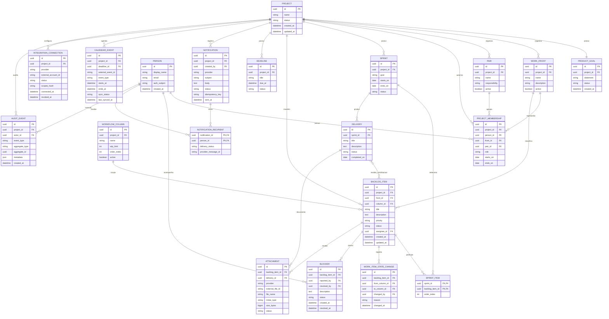

# 05 — Modelo de Dados

**Projeto:** Sistema Web de Gestão Ágil do Projeto Acadêmico  
**Versão:** 1.0  
**Status:** proposta para validação  
**Origem:** [04 — Modelo de Domínio](04-modelo-de-dominio.md)

## 1. Objetivo

Definir a estrutura persistente inicial do banco PostgreSQL hospedado no Neon. O modelo deve preservar a distinção entre domínio, Sprint, fluxo Kanban e integrações externas.

O banco armazena dados da aplicação e metadados de serviços externos. Arquivos binários permanecem no Google Drive e tokens OAuth não são armazenados em texto puro nas tabelas de domínio.

## 2. Estratégia de persistência

- Banco relacional PostgreSQL no Neon.
- Identificadores internos em UUID.
- Chaves externas Google armazenadas em colunas próprias.
- Migrações versionadas e reversíveis quando possível.
- Histórico de mudanças relevantes preservado em tabelas append-only.
- Exclusão lógica ou arquivamento para dados com valor histórico.
- Regras de autorização aplicadas no servidor antes das consultas e escritas.
- Dados locais continuam disponíveis quando Drive, Gmail ou Calendar estiverem indisponíveis.

## 3. Diagrama entidade-relacionamento

## 4. Tabelas e regras de integridade

### `projects`, `product_goals` e `work_fronts`

- Cada projeto possui uma Meta do Produto vigente.
- Nomes de frentes devem ser únicos dentro do projeto.
- As quatro frentes iniciais são Ensino e Nivelamento, Pesquisa e Desenvolvimento de IA, Extensão e Letramento Algorítmico e Gestão Ágil.
- Projeto arquivado não aceita novas alterações operacionais.

### `people`, `pairs` e `project_memberships`

- Uma pessoa pode participar de mais de um projeto futuramente.
- O e-mail não é chave primária.
- O vínculo define papel, frente, dupla e período de validade.
- Deve existir no máximo um Product Owner ativo por projeto.
- O Scrum Master atual deve ser identificável sem eliminar o histórico de alternâncias.
- A dupla de Gestão Ágil não substitui a accountability individual do Scrum Master.

### `sprints`, `backlog_items` e `sprint_items`

- Um item pode participar de várias Sprints ao longo do tempo, mas não deve possuir duplicação na mesma Sprint.
- `sprint_items` é uma tabela associativa com ordem própria.
- O Product Backlog continua existindo independentemente da seleção para uma Sprint.
- Apenas uma Sprint deve estar em andamento por projeto, salvo decisão posterior documentada.
- O encerramento de Sprint não deve apagar seus itens, entregas ou histórico.

### `workflow_columns` e `work_item_state_changes`

- Colunas pertencem ao projeto e possuem ordenação explícita.
- `wip_limit` nulo significa limite não configurado; zero não deve ser interpretado automaticamente como ilimitado.
- Toda alteração de coluna gera `work_item_state_changes`.
- Mudanças de histórico não devem ser atualizadas ou apagadas em operações comuns.
- O servidor recalcula o WIP no momento da movimentação para evitar condição de corrida.

### `attachments`

- Deve existir associação com um item, uma entrega ou ambos, conforme a regra de negócio.
- `external_file_id` deve ser único por provedor.
- O banco guarda metadados e link, não o conteúdo binário.
- Upload pendente ou falho pode ser retentado sem criar duplicidade.

### `notifications` e `notification_recipients`

- A chave de idempotência evita o mesmo envio automático mais de uma vez.
- Destinatários devem pertencer ao projeto ou estar explicitamente autorizados.
- O status do envio geral não substitui o status individual dos destinatários.
- O conteúdo deve seguir a política de retenção definida pelo projeto.

### `calendar_events`

- Um evento local pode existir sem evento Google.
- `external_event_id` é preenchido somente após sincronização bem-sucedida.
- Falha de sincronização altera `sync_status`, mas não invalida o evento interno.

### `integration_connections`

- Tokens não devem ser armazenados diretamente nesta tabela.
- Segredos, quando necessários, devem usar armazenamento seguro e referência criptografada.
- Revogação deve preservar auditoria sem permitir novas chamadas externas.

## 5. Índices recomendados

- `project_memberships(project_id, person_id, role)`;
- `backlog_items(project_id, status, front_id)`;
- `sprint_items(sprint_id, order_index)`;
- `work_item_state_changes(backlog_item_id, changed_at)`;
- `blockers(backlog_item_id, status)`;
- `deliveries(project_id, status, completed_on)`;
- `attachments(provider, external_file_id)` unique;
- `notifications(project_id, status, created_at)`;
- `calendar_events(project_id, sync_status)`;
- `audit_events(project_id, created_at)`.

## 6. Migrações e seeds

As migrações devem ser versionadas e executadas em ordem. Cada alteração de schema deve documentar impacto, dependências e estratégia de rollback.

Seeds iniciais sugeridos:

- quatro frentes do projeto;
- oito pessoas somente quando os dados reais forem fornecidos;
- duplas somente após validação da composição;
- colunas do fluxo somente após descoberta com a equipe;
- reuniões de terça e quarta em agenda interna, exceto feriados conforme calendário definido.

## 7. Transações críticas

### Movimentação de item

1. Validar sessão e autorização.
2. Bloquear ou verificar o item e a coluna de destino.
3. Recalcular WIP da coluna.
4. Validar política e limite.
5. Atualizar estado atual.
6. Inserir histórico.
7. Inserir auditoria.
8. Confirmar transação.

### Upload Drive

1. Criar operação local pendente.
2. Enviar arquivo ao Drive.
3. Persistir identificador e metadados em caso de sucesso.
4. Atualizar status e auditoria.
5. Marcar falha recuperável sem apagar o item em caso de erro.

### Envio Gmail

1. Validar destinatários.
2. Criar notificação pendente com chave de idempotência.
3. Enviar pelo gateway.
4. Atualizar resultado geral e individual.
5. Registrar auditoria sem armazenar segredo.

## 8. Relação com outros documentos

- [02 — Requisitos](02-requisitos.md)
- [03 — Casos de Uso](03-casos-de-uso.md)
- [04 — Modelo de Domínio](04-modelo-de-dominio.md)
- [Especificação técnica inicial](../especificacao-tecnica.md)
- [Arquitetura](../arquitetura/arquitetura.md)
