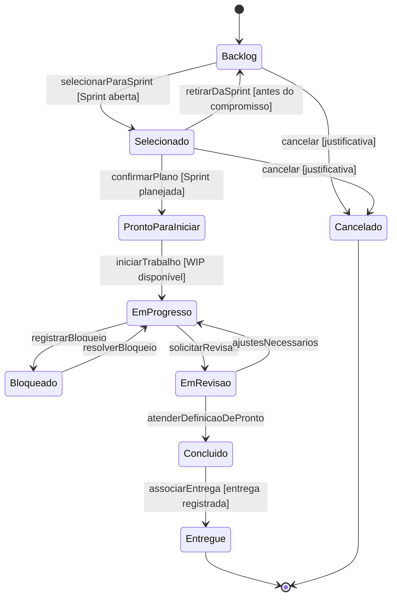
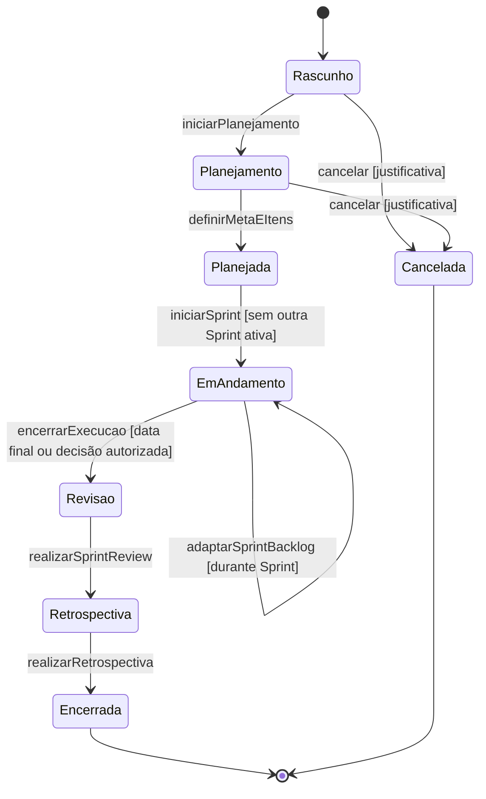
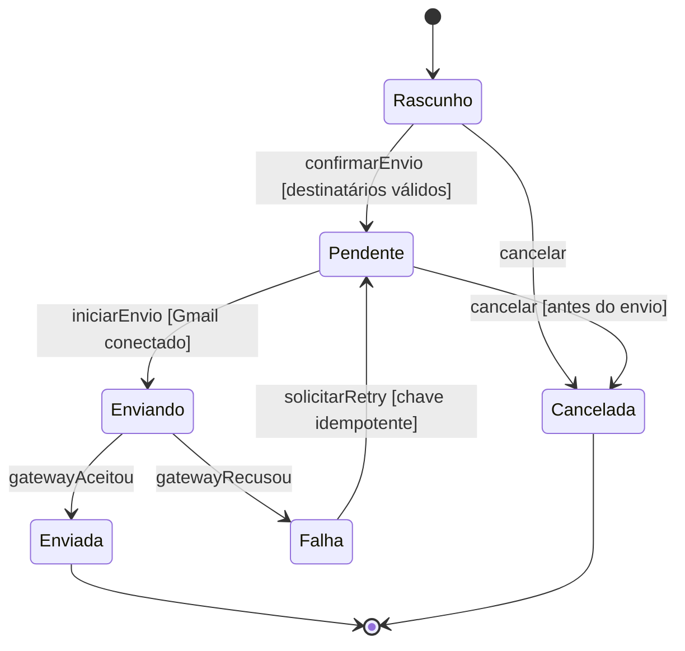
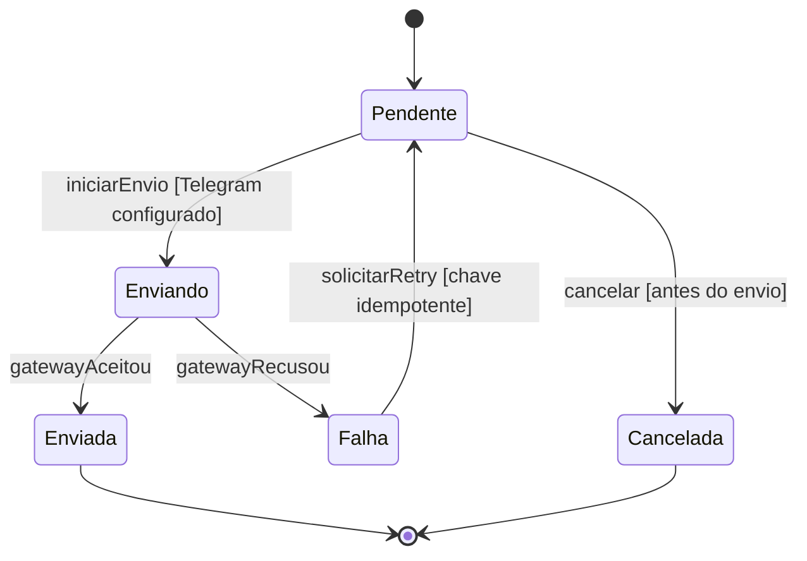
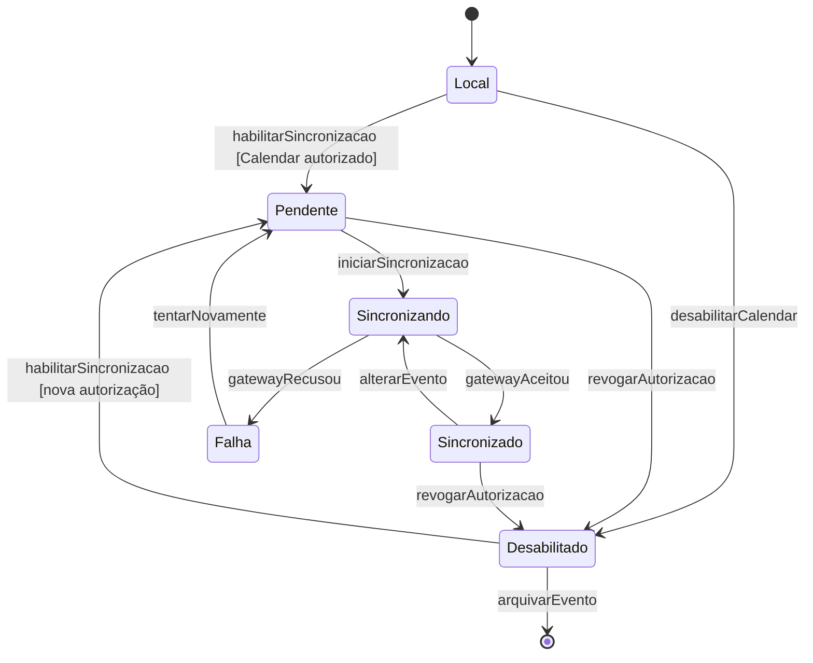
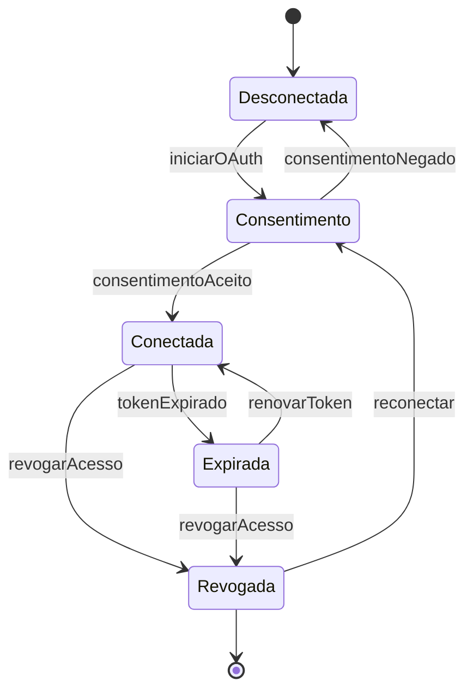

# 06 — Diagramas de Estados

**Projeto:** Sistema Web de Gestão Ágil do Projeto Acadêmico  
**Versão:** 1.0  
**Status:** proposta para validação  
**Origem:** [04 — Modelo de Domínio](04-modelo-de-dominio.md)

## 1. Objetivo

Documentar os ciclos de vida das entidades que possuem múltiplos estados e regras de transição. O estado deve ser alterado por métodos de domínio ou casos de uso autorizados, nunca por troca solta de coluna no banco.

Foram considerados complexos os ciclos de `BacklogItem`, `Sprint`, `Notification` e `CalendarEvent`. A `TelegramMessage` possui ciclo simples, descrito na seção 6.1. As transições definitivas dependem da validação do fluxo real da equipe.

## 2. Regras gerais de transição

- Toda transição deve registrar ator, data, origem, destino e motivo quando aplicável.
- A autorização é validada no servidor.
- Uma transição inválida não altera o estado atual.
- O histórico é append-only.
- Falha de integração externa não deve apagar o estado local.
- WIP é validado no momento da entrada em uma coluna limitada.
- A quarta-feira é um tipo de reunião relevante, mas não altera o ciclo de vida da Sprint por si só.

## 3. Estado do `BacklogItem`

### Regras

- `Backlog` representa item disponível no Product Backlog.
- `Selecionado` representa item escolhido para o Sprint Backlog.
- `EmProgresso` exige respeito ao WIP da coluna correspondente.
- `Bloqueado` exige um `Blocker` aberto relacionado.
- `Concluido` exige a Definição de Pronto.
- `Entregue` exige vínculo com uma `Delivery` válida.
- `Cancelado` exige justificativa e não deve ser confundido com concluído.

## 4. Estado da `Sprint`

### Regras

- `EmAndamento` não pode coexistir com outra Sprint ativa no mesmo projeto, salvo decisão explícita futura.
- A Meta da Sprint deve existir antes de `Planejada`.
- O Sprint Backlog pode ser adaptado durante `EmAndamento` sem alterar a identidade do Product Backlog.
- A reunião de quarta-feira pode apoiar inspeção, Review ou adaptação conforme o calendário definido, mas não cria um estado adicional.
- Uma Sprint encerrada mantém itens, histórico, entregas e decisões.

## 5. Estado da `Notification` (Gmail)

### Regras

- O frontend não pode apresentar `Enviada` antes da confirmação do servidor.
- Retry deve respeitar a chave de idempotência e o status dos destinatários.
- O corpo da mensagem e os dados de auditoria devem seguir a política de retenção aprovada.

## 5.1 Estado da `TelegramMessage`

### Regras

- A mensagem é gerada a partir de um evento do projeto (item movido, bloqueio, Sprint, entrega).
- A configuração do grupo e do bot é feita pelo Scrum Master.
- `Falha` mantém o vínculo com o evento original e não corrompe os dados locais.
- Retry respeita a chave de idempotência.

## 6. Estado do `CalendarEvent`

### Regras

- `Local` é válido sem qualquer conta Google conectada.
- `Sincronizado` exige `external_event_id` persistido.
- `Falha` não remove o evento interno.
- `Desabilitado` impede chamadas externas, mas preserva o compromisso local.
- Alterações locais em evento sincronizado devem gerar nova sincronização controlada.

## 7. Estado da `IntegrationConnection`

Tokens e segredos não aparecem como atributos do domínio. O estado representa somente a conexão e suas capacidades autorizadas. A configuração da conexão, inclusive do Telegram, é responsabilidade do Scrum Master.

## 8. Matriz de responsabilidade

| Transição | Responsável autorizado |
|---|---|
| Selecionar item para Sprint | Developers com apoio do Product Owner |
| Mover item no fluxo | Membro responsável na frente com permissão ou Scrum Master |
| Resolver bloqueio | Membro responsável ou Scrum Master, conforme política |
| Encerrar Sprint | Scrum Team conforme processo validado |
| Ordenar Product Backlog | Product Owner |
| Consultar todos os planos (frentes) | Product Owner (e Scrum Master conforme permissão) |
| Enviar Gmail | Scrum Master |
| Enviar mensagem ao grupo Telegram | Sistema (eventos automáticos) ou Scrum Master |
| Sincronizar Calendar | Scrum Master ou agendador autorizado |
| Delimitar permissões de acesso/edição dos membros por frente | Scrum Master |
| Conectar/revogar integrações (Google e Telegram) | Scrum Master |

## 9. Eventos de domínio sugeridos

- `BacklogItemSelectedForSprint`;
- `BacklogItemMoved`;
- `BlockerOpened`;
- `BlockerResolved`;
- `DeliveryCompleted`;
- `SprintStarted`;
- `SprintAdapted`;
- `SprintClosed`;
- `NotificationSent`;
- `NotificationFailed`;
- `TelegramMessageSent`;
- `TelegramMessageFailed`;
- `CalendarEventSynchronized`;
- `IntegrationRevoked`;
- `FrontPermissionChanged`.

Esses eventos devem gerar auditoria quando alterarem informações relevantes do projeto.

## 10. Pendências

- validar nomes finais das colunas do fluxo;
- validar se `Entregue` será estado do item ou apenas consequência de uma `Delivery`;
- definir quem pode forçar uma transição excepcional;
- confirmar duração e regras de encerramento da Sprint;
- definir política de retry do Telegram, Gmail e Calendar;
- definir feriados e calendário acadêmico.

## 11. Referências

- [02 — Requisitos](02-requisitos.md)
- [03 — Casos de Uso](03-casos-de-uso.md)
- [04 — Modelo de Domínio](04-modelo-de-dominio.md)
- [05 — Modelo de Dados](05-modelo-de-dados.md)
