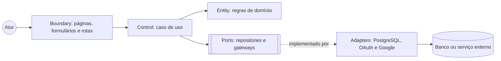
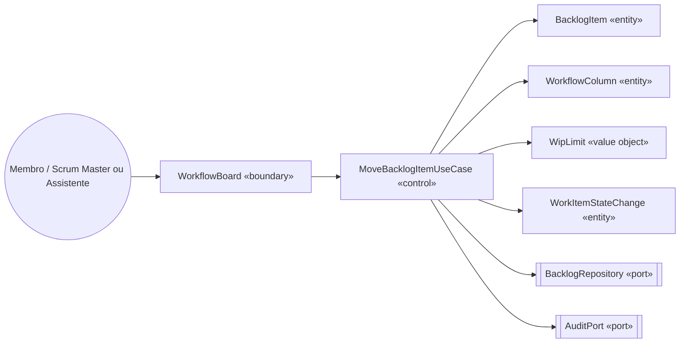
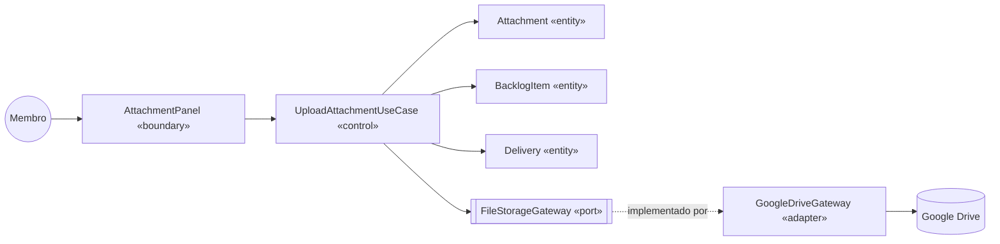
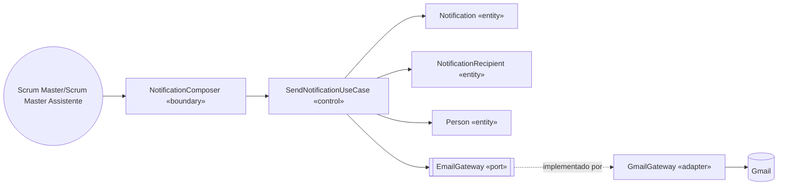
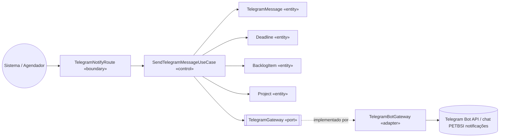

# 07 — Boundary, Control e Entity

**Projeto:** Sistema Web de Gestão Ágil do Projeto Acadêmico  
**Versão:** 1.0  
**Status:** proposta para validação  
**Origem:** [03 — Casos de Uso](03-casos-de-uso.md) e [04 — Modelo de Domínio](04-modelo-de-dominio.md)

## 1. Objetivo

Classificar as partes do sistema segundo a análise Boundary-Control-Entity (BCE):

- **Boundary:** interface de entrada ou saída com usuário, sistema externo ou mecanismo temporal.
- **Control:** caso de uso que orquestra validação, regras e persistência sem guardar estado de negócio.
- **Entity:** entidade ou value object que representa dados e regras do domínio.

Essa separação será traduzida posteriormente para as camadas de Clean Architecture.

## 2. Convenções

- Boundaries não decidem regras de autorização ou transição de domínio.
- Controls não acessam tabelas diretamente; dependem de ports/repositories.
- Entities não conhecem React, Next.js, banco ou SDK Google/Telegram.
- Gateways externos são adapters usados pelos controls através de portas.
- Uma operação de escrita deve passar por autorização e auditoria quando exigido.

## 3. Mapeamento por caso de uso

| Caso de uso | Boundary | Control | Entities e ports |
|---|---|---|---|
| UC01 Autenticar usuário | `LoginPage`, `AuthCallbackRoute` | `AuthenticateUserUseCase` | `Person`, `ProjectMembership`, `AuthGateway`, `SessionRepository` |
| UC02 Consultar visão geral | `ProjectOverviewPage` | `GetProjectOverviewUseCase` | `Project`, `ProductGoal`, `Sprint`, `BacklogItem`, `Blocker`, `Delivery`, `Deadline` |
| UC03 Gerenciar Product Backlog | `ProductBacklogPage`, `BacklogItemForm` | `ManageBacklogUseCase` | `Project`, `BacklogItem`, `WorkFront`, `ProjectMembership`, `BacklogRepository`, `AuditPort` |
| UC04 Planejar Sprint | `SprintPlanningPage` | `PlanSprintUseCase` | `Sprint`, `SprintItem`, `BacklogItem`, `ProjectMembership`, `SprintRepository` |
| UC05 Atualizar item no fluxo | `WorkflowBoard` | `MoveBacklogItemUseCase` | `BacklogItem`, `WorkflowColumn`, `WipLimit`, `WorkItemStateChange`, `BacklogRepository`, `AuditPort` |
| UC06 Gerenciar bloqueio | `BlockerPanel` | `ManageBlockerUseCase` | `BacklogItem`, `Blocker`, `Person`, `AuditPort` |
| UC07 Consultar entregas e histórico | `DeliveryHistoryPage` | `QueryDeliveryHistoryUseCase` | `Delivery`, `BacklogItem`, `Sprint`, `WorkFront`, `AuditEvent` |
| UC08 Enviar arquivo ao Drive | `AttachmentPanel`, `UploadRoute` | `UploadAttachmentUseCase` | `Attachment`, `BacklogItem`, `Delivery`, `FileStorageGateway`, `AttachmentRepository`, `AuditPort` |
| UC09 Enviar notificação por Gmail | `NotificationComposer`, `SendNotificationRoute` | `SendNotificationUseCase` | `Notification`, `NotificationRecipient`, `Person`, `EmailGateway`, `NotificationRepository`, `AuditPort` |
| UC10 Configurar lembrete | `ReminderForm`, `AgendaPage` | `ConfigureReminderUseCase` | `Deadline`, `CalendarEvent`, `Person`, `CalendarRepository` |
| UC11 Sincronizar Calendar | `CalendarSyncRoute`, `SchedulerAdapter` | `SyncCalendarEventUseCase` | `CalendarEvent`, `Deadline`, `Sprint`, `CalendarGateway`, `CalendarEventRepository`, `AuditPort` |
| UC12 Configurar integração | `IntegrationSettingsPage`, `OAuthCallbackRoute` | `ManageIntegrationConnectionUseCase` | `IntegrationConnection`, `AuthGateway`, `FileStorageGateway`, `EmailGateway`, `TelegramGateway`, `CalendarGateway`, `AuditPort` |
| UC15 Enviar notificação por Telegram | `TelegramNotifyRoute`, `EventNotificationAdapter`, `DeadlineReminderAdapter` | `SendTelegramMessageUseCase` | `TelegramMessage`, `Project`, `Deadline`, `BacklogItem`, `TelegramGateway`, `TelegramMessageRepository`, `AuditPort` |
| UC16 Gerenciar permissões por frente | `FrontPermissionsPage` | `ManageFrontPermissionsUseCase` | `ProjectMembership`, `WorkFront`, `Project`, `AuditPort` |

## 4. Diagrama de robustez geral

## 5. Robustez dos fluxos críticos

### 5.1 Atualização de item no fluxo

### 5.2 Upload ao Drive

### 5.3 Notificação por Gmail

### 5.4 Notificação por Telegram

## 6. Responsabilidades e limites

| Elemento | Pode fazer | Não deve fazer |
|---|---|---|
| Boundary | Capturar entrada, apresentar estado e encaminhar comando | Aplicar autorização ou mudar estado diretamente |
| Control | Orquestrar caso de uso, validar regras e coordenar ports | Renderizar tela ou conter conexão SQL/SDK diretamente |
| Entity | Manter invariantes e comportamento do domínio | Conhecer HTTP, React, banco ou Google |
| Repository port | Definir contrato de persistência | Depender de uma tabela específica na camada de domínio |
| Gateway port | Definir contrato de serviço externo | Expor tokens ao frontend |
| Adapter | Converter tecnologia externa para port | Espalhar detalhes de fornecedores externos pelo domínio |

## 7. Relação com Clean Architecture

| BCE | Camada correspondente |
|---|---|
| Boundary de tela/rota | Interface Adapters / Frameworks |
| Control | Application / Use Cases |
| Entity e Value Object | Domain |
| Repository e Gateway concreto | Interface Adapters / Infrastructure |
| Banco, Next.js, OAuth e SDK Google | Frameworks & Drivers |

## 8. Referências

- [02 — Requisitos](02-requisitos.md)
- [03 — Casos de Uso](03-casos-de-uso.md)
- [04 — Modelo de Domínio](04-modelo-de-dominio.md)
- [05 — Modelo de Dados](05-modelo-de-dados.md)
- [Arquitetura](../arquitetura/arquitetura.md)
