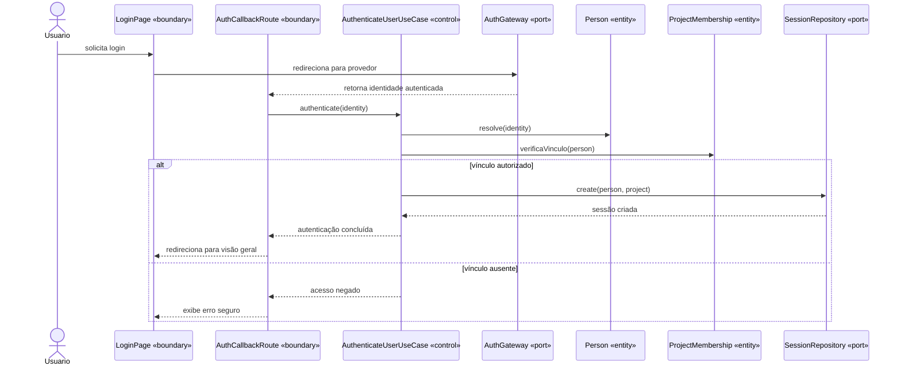
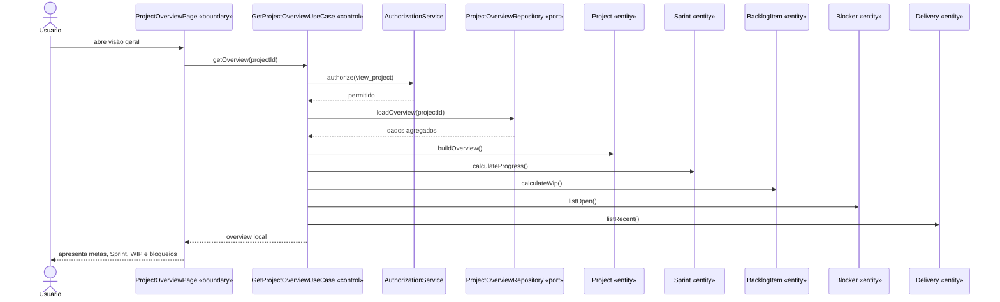
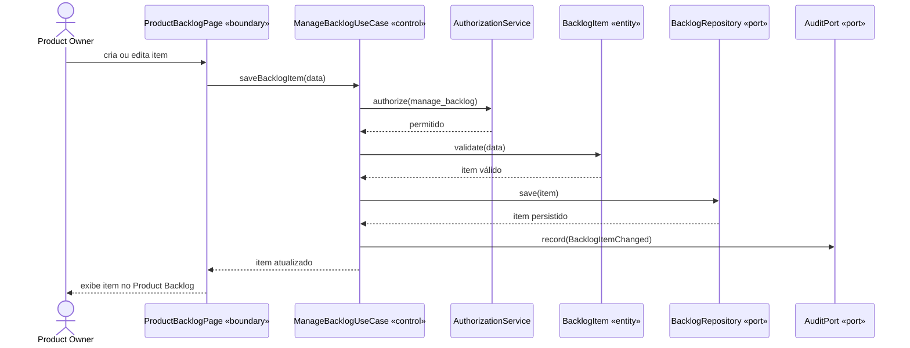
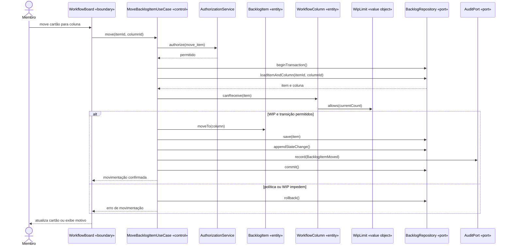
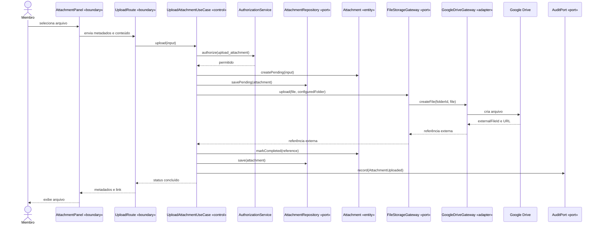
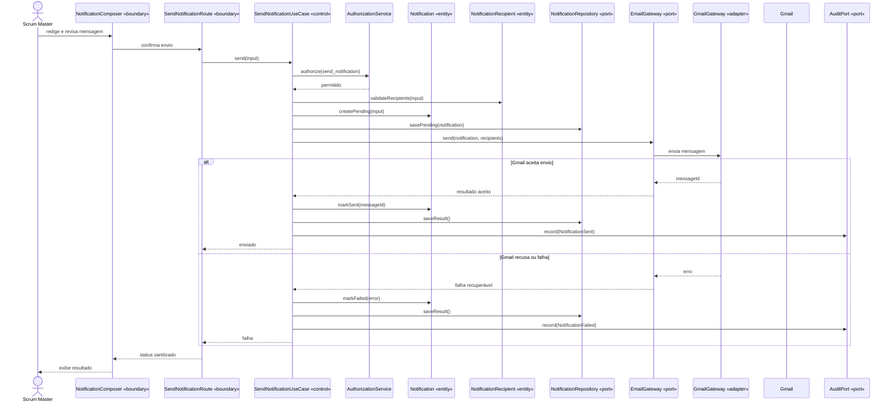
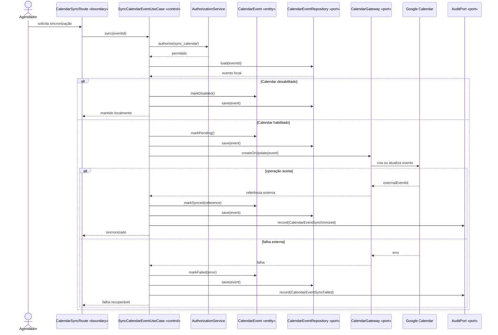
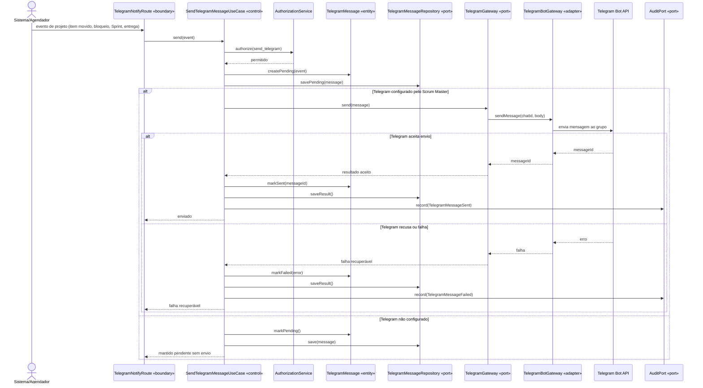

# 08 — Diagramas de Sequência

**Projeto:** Sistema Web de Gestão Ágil do Projeto Acadêmico  
**Versão:** 1.0  
**Status:** proposta para validação  
**Origem:** [03 — Casos de Uso](03-casos-de-uso.md) e [07 — Boundary, Control e Entity](07-boundary-control-entity.md)

## 1. Objetivo

Descrever a ordem temporal das mensagens entre atores, boundaries, controls, entities, repositories e gateways. Os diagramas devem orientar os contratos de aplicação e os testes de caso de uso.

## 2. UC01 — Autenticar usuário

## 3. UC02 — Consultar visão geral

## 4. UC03 — Gerenciar Product Backlog

## 5. UC05 — Atualizar item no fluxo

## 6. UC08 — Enviar arquivo ao Drive

## 7. UC09 — Enviar notificação por Gmail

## 8. UC11 — Sincronizar Calendar

## 9. UC15 — Enviar notificação por Telegram

## 10. Rastreabilidade para testes

| Diagrama | Teste de aplicação correspondente |
|---|---|
| UC01 | autenticação, vínculo e acesso negado |
| UC02 | agregação da visão geral sem dependência Google |
| UC03 | Product Owner cria e ordena item |
| UC05 | movimentação válida, WIP excedido e rollback |
| UC08 | upload concluído, falha e retry idempotente |
| UC09 | envio aceito, falha e status por destinatário |
| UC11 | sincronização, Calendar desabilitado e falha externa |
| UC15 | Telegram configurado/ausente, envio aceito, falha e retry idempotente |

## 11. Referências

- [02 — Requisitos](02-requisitos.md)
- [03 — Casos de Uso](03-casos-de-uso.md)
- [04 — Modelo de Domínio](04-modelo-de-dominio.md)
- [05 — Modelo de Dados](05-modelo-de-dados.md)
- [07 — Boundary, Control e Entity](07-boundary-control-entity.md)
