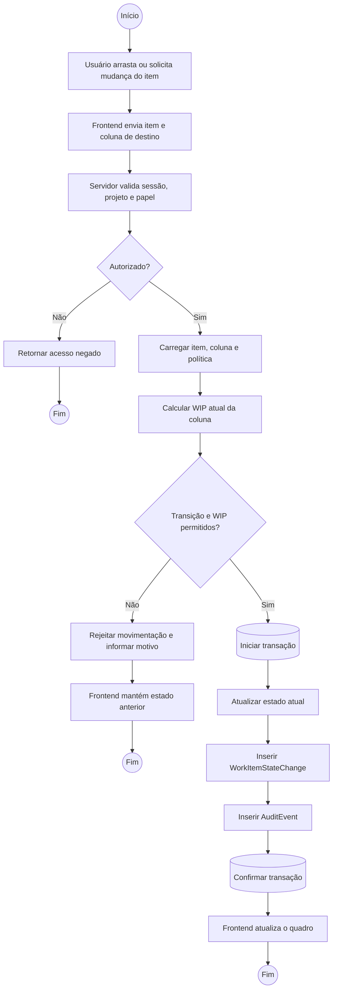
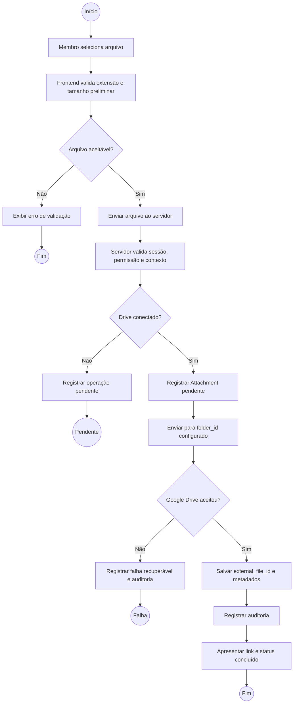
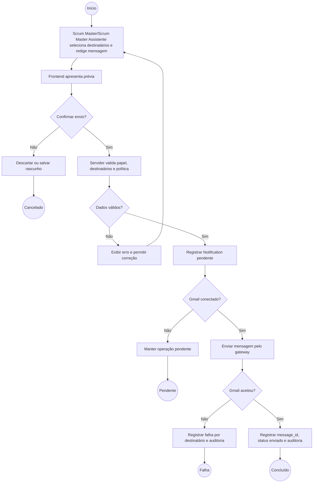
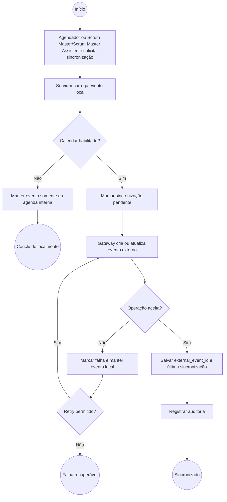

# 09 — Diagramas de Atividade

**Projeto:** Sistema Web de Gestão Ágil do Projeto Acadêmico  
**Versão:** 1.0  
**Status:** proposta para validação  
**Origem:** [03 — Casos de Uso](03-casos-de-uso.md) e [08 — Diagramas de Sequência](08-diagramas-de-sequencia.md)

## 1. Objetivo

Representar os fluxos de negócio com decisões, alternativas e responsabilidades distribuídas entre usuário, frontend, servidor, banco e serviços externos.

## 2. Atividade — Planejar Sprint

**Raias:** Coordenador (Product Owner), Developers, Sistema.

```mermaid
flowchart TD
    Start((Início)) --> PO1[Coordenador (Product Owner) comunica prioridade e contexto]
    PO1 --> Dev1[Developers inspecionam itens do Product Backlog]
    Dev1 --> Decision1{Item compreendido?}
    Decision1 -- Não --> Refine[Esclarecer e refinar item]
    Refine --> Dev1
    Decision1 -- Sim --> Select[Selecionar item para a Sprint]
    Select --> Goal[Definir Meta da Sprint]
    Goal --> Decision2{Meta e itens coerentes?}
    Decision2 -- Não --> Adjust[Ajustar meta ou seleção]
    Adjust --> Goal
    Decision2 -- Sim --> Save[Salvar Sprint e Sprint Backlog]
    Save --> Audit[Registrar histórico e auditoria]
    Audit --> End((Sprint planejada))
```

## 3. Atividade — Atualizar item no fluxo Kanban

**Raias:** Membro/Scrum Master ou Assistente, Frontend, Servidor, Banco.



## 4. Atividade — Enviar arquivo ao Google Drive

**Raias:** Membro, Frontend, Servidor, Google Drive.



## 5. Atividade — Enviar notificação por Gmail

**Raias:** Scrum Master/Scrum Master Assistente, Frontend, Servidor, Gmail.



## 6. Atividade — Sincronizar evento com Google Calendar

**Raias:** Agendador/Scrum Master ou Assistente, Servidor, Agenda local, Google Calendar.



## 7. Atividade — Enviar notificação por Telegram

**Raias:** Sistema/Agendador, Servidor, Telegram Bot API.

```mermaid
flowchart TD
    Start((Início)) --> Event[Evento do projeto: item movido, bloqueio, Sprint iniciada/encerrada ou entrega]
    Event --> DecideKind{É lembrete de prazo?}
    DecideKind -- Sim --> Reminder[Gerar "A tarefa X falta Y dias para o prazo final." a partir do Deadline não nulo]
    DecideKind -- Não --> Keep[Manter mensagem do evento]
    Reminder --> Validate[Servidor valida lembrete, evento e permissão de envio]
    Keep --> Validate
    Validate --> Decision1{chat "PETBSI notificações" configurado pelo Scrum Master/Scrum Master Assistente?}
    Decision1 -- Não --> Pending[Manter telegram_message pendente]
    Pending --> End1((Pendente))
    Decision1 -- Sim --> Create[Registrar TelegramMessage pendente]
    Create --> Send[Enviar mensagem ao chat "PETBSI notificações" pelo bot]
    Send --> Decision2{Telegram aceitou?}
    Decision2 -- Não --> Failed[Registrar falha recuperável e auditoria]
    Failed --> End2((Falha recuperável))
    Decision2 -- Sim --> Save[Registrar message_id, status enviado e auditoria]
    Save --> End3((Concluído))
```

## 8. Pontos de decisão relevantes

| Fluxo | Decisões que devem ser regra de domínio ou aplicação |
|---|---|
| Sprint | entendimento do item, coerência entre Meta da Sprint e seleção |
| Fluxo | autorização, permissão de frente, transição permitida, limite de WIP e transação |
| Drive | tipo/tamanho, autorização, conexão e resultado externo |
| Gmail | destinatários, confirmação, conexão, idempotência e resultado |
| Calendar | habilitação, autorização, sincronização, falha e retry |
| Telegram | habilitação/configuração do chat "PETBSI notificações", permissão, lembrete de prazo com formato "A tarefa X falta Y dias...", conexão, idempotência e resultado |

## 9. Referências

- [02 — Requisitos](02-requisitos.md)
- [03 — Casos de Uso](03-casos-de-uso.md)
- [06 — Diagramas de Estados](06-diagrama-de-estados.md)
- [07 — Boundary, Control e Entity](07-boundary-control-entity.md)
- [08 — Diagramas de Sequência](08-diagramas-de-sequencia.md)
