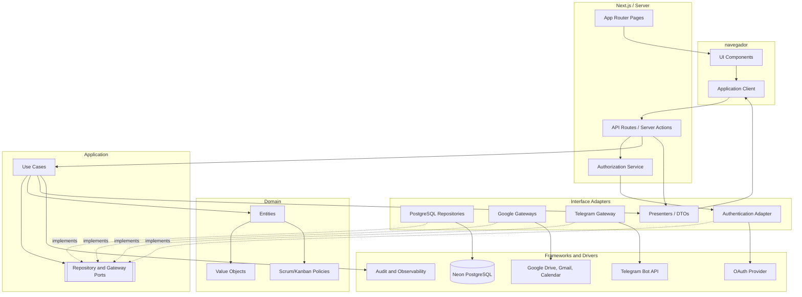
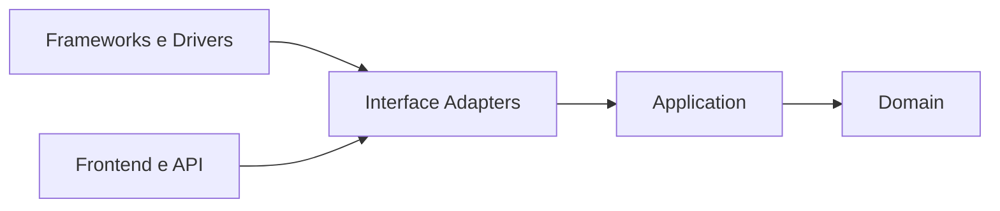
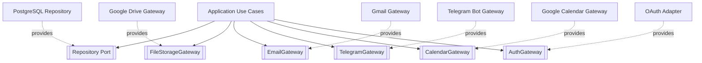
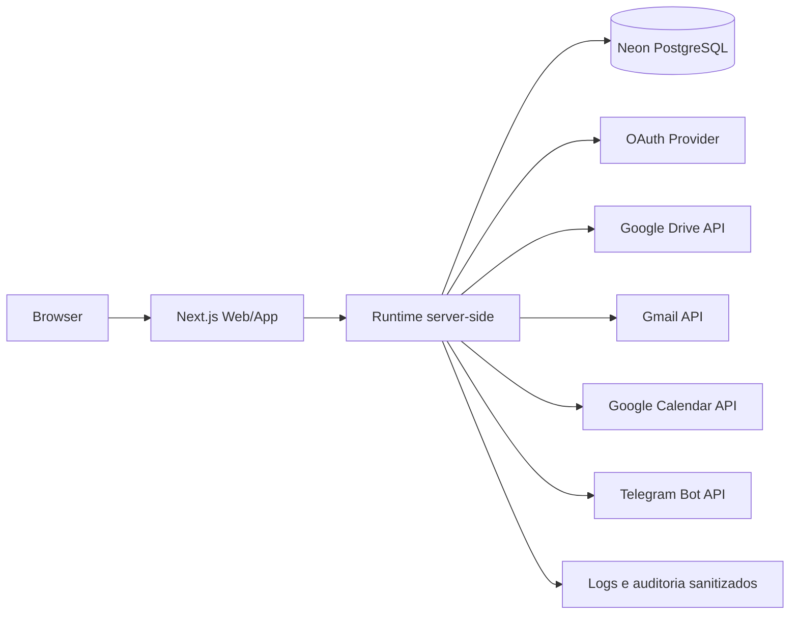

# 10 — Diagrama de Componentes

**Projeto:** Sistema Web de Gestão Ágil do Projeto Acadêmico  
**Versão:** 1.0  
**Status:** proposta para validação  
**Origem:** [07 — Boundary, Control e Entity](07-boundary-control-entity.md) e [Arquitetura](../arquitetura/arquitetura.md)

## 1. Objetivo

Descrever os componentes técnicos, suas responsabilidades e dependências. O diagrama materializa a arquitetura definida anteriormente, sem permitir que o frontend, o banco ou os SDKs de Internet (Google e Telegram) contaminem o domínio.

## 2. Componentes

| Componente | Responsabilidade | Dependências permitidas |
|---|---|---|
| Next.js App Router | Rotas, layouts, páginas e Server Actions | componentes e adapters de entrada |
| UI Components | Apresentação e interação | cliente de aplicação |
| Application Client | Comunicação do frontend com servidor | rotas/API |
| API/Server Actions | Entrada, validação de formato e contexto | casos de uso |
| Authorization Service | Sessão, projeto, papel e permissão de frente | gateway de autenticação e membership repository |
| Application Use Cases | Orquestração dos fluxos | domínio e ports |
| Domain Model | Entidades, value objects e políticas | nenhuma infraestrutura |
| Repository Adapters | Persistência PostgreSQL | cliente Neon |
| Google Gateways | Drive, Gmail e Calendar | OAuth, SDKs Google e retry |
| Telegram Gateway | Envio de notificações ao grupo do projeto | bot do Telegram e retry |
| Auth Adapter | Identidade e sessão | provedor OAuth |
| Neon PostgreSQL | Dados locais e histórico | conexão server-side |
| Google APIs | Arquivos, e-mails e eventos externos | OAuth autorizado |
| Telegram Bot API | Mensagens no grupo do projeto | bot autorizado |
| Audit/Observability | Auditoria, logs sanitizados e métricas | armazenamento configurado |

## 3. Diagrama de componentes

## 4. Direção das dependências

A direção conceitual é de fora para dentro: componentes externos dependem de contratos internos. O domínio não deve importar componentes externos.

## 5. Contratos fornecidos e requeridos

## 6. Fronteiras de segurança

- O navegador conhece somente dados de tela, comandos e respostas sanitizadas.
- `app/api`, Server Actions e `src/server` executam validação de sessão e autorização.
- Repositories usam o banco somente no servidor.
- Google Gateways e Telegram Gateway usam tokens somente no servidor.
- O domínio não recebe token, `folder_id` arbitrário ou segredo de Google nem do Telegram.
- Logs não registram credenciais, tokens ou conteúdo sensível desnecessário.
- Falhas de integração são convertidas em estados de aplicação, não em exceções vazadas para o usuário.

## 7. Componentes por funcionalidade

| Funcionalidade | Frontend | Application | Adapter/Driver |
|---|---|---|---|
| Visão geral | `ProjectOverviewPage` | `GetProjectOverviewUseCase` | `ProjectOverviewRepository` / Neon |
| Product Backlog | `ProductBacklogPage` | `ManageBacklogUseCase` | `BacklogRepository` / Neon |
| Fluxo Kanban | `WorkflowBoard` | `MoveBacklogItemUseCase` | `BacklogRepository` / Neon |
| Upload | `AttachmentPanel` | `UploadAttachmentUseCase` | `GoogleDriveGateway` / Drive |
| Notificação Gmail | `NotificationComposer` | `SendNotificationUseCase` | `GmailGateway` / Gmail |
| Notificação Telegram | `EventNotificationAdapter` | `SendTelegramMessageUseCase` | `TelegramBotGateway` / Telegram |
| Permissões por frente | `FrontPermissionsPage` | `ManageFrontPermissionsUseCase` | `ProjectMembership` / Neon |
| Agenda | `AgendaPage` | `ConfigureReminderUseCase` | `CalendarRepository` / Neon |
| Sincronização | `CalendarSyncRoute` | `SyncCalendarEventUseCase` | `GoogleCalendarGateway` / Calendar |
| Integrações | `IntegrationSettingsPage` | `ManageIntegrationConnectionUseCase` | `AuthAdapter`, gateways Google e Telegram |

## 8. Deploy lógico

O frontend pode ser entregue como aplicação Next.js, mas a execução server-side precisa permanecer protegida e configurada com variáveis de ambiente. A escolha final de hospedagem e observabilidade permanece pendente.

## 9. Regras de evolução

1. Um novo componente deve declarar sua responsabilidade e camada.
2. Uma integração externa deve ser introduzida por uma port e um adapter.
3. Um caso de uso não deve importar SDK de banco, Google ou Telegram.
4. Uma entidade não deve depender de uma página ou rota.
5. Mudanças de persistência devem permanecer nos repositories e migrations.
6. Todo componente novo deve possuir testes compatíveis com sua camada.

## 10. Referências

- [02 — Requisitos](02-requisitos.md)
- [03 — Casos de Uso](03-casos-de-uso.md)
- [07 — Boundary, Control e Entity](07-boundary-control-entity.md)
- [08 — Diagramas de Sequência](08-diagramas-de-sequencia.md)
- [Arquitetura](../arquitetura/arquitetura.md)
- [Árvore de arquivos](../tree.md)
