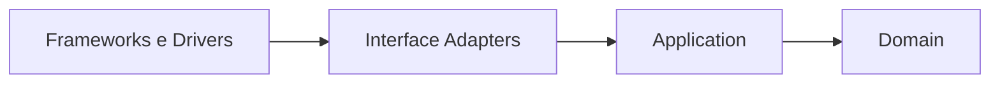

# 11 — DDD e Clean Architecture

**Projeto:** Sistema Web de Gestão Ágil do Projeto Acadêmico  
**Versão:** 1.0  
**Status:** orientação de implementação  
**Origem:** [04 — Modelo de Domínio](04-modelo-de-dominio.md) e [10 — Diagrama de Componentes](10-diagrama-de-componentes.md)

## 1. Objetivo

Orientar a implementação do software usando Domain-Driven Design (DDD) e Clean Architecture. As regras do projeto devem permanecer independentes da interface, do banco Neon e das APIs Google e do Telegram.

## 2. Linguagem ubíqua

Os nomes do código devem preservar os termos usados pela equipe e pelos documentos:

- Projeto;
- Produto e Meta do Produto;
- Product Backlog;
- Sprint e Meta da Sprint;
- Sprint Backlog;
- Item de Trabalho;
- Entrega;
- Frente;
- Bloqueio;
- Fluxo;
- WIP;
- Scrum Master e Scrum Master Assistente;
- Coordenador (Product Owner);
- Membro (Developer) com título padrão "Membro" e exibição "Visitante" quando sem permissão de edição;
- Integração;
- Anexo;
- Notificação;
- Mensagem Telegram;
- Grupo do Telegram;
- Sincronização.

Não usar termos genéricos como `Manager`, `Helper` ou `Processor` para esconder regras de domínio.

## 3. Bounded Contexts iniciais

| Contexto | Responsabilidade | Entidades principais |
|---|---|---|
| Gestão do Projeto | metas, frentes, participantes e papéis | `Project`, `ProductGoal`, `WorkFront`, `Person`, `ProjectMembership`, `Pair` |
| Planejamento Scrum | Product Backlog, Sprints e seleção de itens | `BacklogItem`, `Sprint`, `SprintItem` |
| Fluxo Kanban | colunas, WIP, bloqueios e mudanças de estado | `WorkflowColumn`, `WorkItemStateChange`, `Blocker` |
| Entregas e Histórico | resultados verificáveis, prazos e auditoria | `Delivery`, `Deadline`, `AuditEvent` |
| Integrações | arquivos, notificações (Gmail), mensagens do chat "PETBSI notificações", agenda e conexões externas | `Attachment`, `Notification`, `TelegramMessage`, `CalendarEvent`, `IntegrationConnection` |

Os contextos compartilham o identificador do projeto, mas não devem acessar diretamente o estado interno dos agregados uns dos outros.

## 4. Aggregates e invariantes

| Aggregate Root | Invariantes essenciais | Repository |
|---|---|---|
| `Project` | máximo de um coordenador exercendo o Product Owner; frentes pertencem ao projeto | `ProjectRepository` |
| `Sprint` | Meta da Sprint definida antes de iniciar; seleção pertence à Sprint | `SprintRepository` |
| `BacklogItem` | transição permitida; WIP respeitado; bloqueio consistente | `BacklogItemRepository` |
| `Delivery` | entrega possui contexto, estado e vínculos válidos | `DeliveryRepository` |
| `Notification` | destinatários permitidos; status e idempotência consistentes | `NotificationRepository` |
| `TelegramMessage` | chat "PETBSI notificações" configurado pelo Scrum Master/Scrum Master Assistente; lembrete de prazo gerado pelo Agendador somente para tarefa com `Deadline` definido, formato "A tarefa X falta Y dias para o prazo final."; status e idempotência consistentes; falha preserva dados locais | `TelegramMessageRepository` |
| `CalendarEvent` | evento local válido sem Google; sincronização rastreável | `CalendarEventRepository` |

### Regras de acesso

- `SprintItem` só é alterado através de `Sprint`.
- `Blocker` e `WorkItemStateChange` só são criados através de operações do `BacklogItem`.
- `NotificationRecipient` só é alterado através de `Notification`.
- `Attachment` só pode ser associado a item ou entrega por um caso de uso autorizado.
- Repositories são definidos por aggregate root, não por cada tabela auxiliar.

## 5. Value Objects

Value objects devem ser imutáveis e comparados por valor:

- `EmailAddress` valida destinatário;
- `DateRange` valida períodos de Sprint e eventos;
- `WipLimit` valida capacidade;
- `ProjectRole` representa responsabilidade;
- `WorkItemStatus` representa estado permitido;
- `BacklogPriority` representa ordenação;
- `DocumentReference` (ExternalFileReference) representa referência externa sem expor token;
- `SyncStatus`, `NotificationStatus`, `TelegramMessageStatus` e `TelegramMessageKind` representam ciclos e tipos de mensagens controlados;

## 6. Camadas da Clean Architecture

### 6.1 Domain

Entidades, value objects, eventos e políticas puras. Não importa framework, banco ou serviços externos.

### 6.2 Application

Casos de uso, DTOs de entrada/saída e portas. Coordena transações e chama entidades, repositories e gateways por contrato.

### 6.3 Interface Adapters

Rotas, Server Actions, presenters, repositories concretos, adapters de autenticação, gateways Google e gateway do Telegram.

### 6.4 Frameworks e Drivers

Next.js, React, Neon/PostgreSQL, ORM/driver, SDKs Google, SDK do Telegram, OAuth, logs e configuração de ambiente.

## 7. Regra de dependência



O domínio pode definir uma interface como `EmailGateway`, mas não pode importar a implementação `GmailGateway`. O caso de uso depende da abstração; o adapter implementa a abstração.

## 8. Portas principais

```text
ProjectRepository
SprintRepository
BacklogItemRepository
DeliveryRepository
NotificationRepository
TelegramMessageRepository
CalendarEventRepository

AuthGateway
FileStorageGateway
EmailGateway
TelegramGateway
CalendarGateway
AuditPort
```

Cada port deve ter contrato pequeno, orientado ao caso de uso e independente do ORM ou SDK usado na implementação.

## 9. Organização de módulos

```text
src/
├── domain/
│   ├── project/
│   ├── people/
│   ├── backlog/
│   ├── sprint/
│   ├── workflow/
│   ├── delivery/
│   └── integration/
├── application/
│   ├── overview/
│   ├── backlog/
│   ├── sprint/
│   ├── workflow/
│   ├── attachments/
│   ├── notifications/
│   ├── telegram-messages/
│   └── calendar/
├── adapters/
│   ├── repositories/
│   ├── google/
│   ├── telegram/
│   ├── http/
│   └── auth/
└── server/
    ├── authorization/
    ├── integrations/
    └── env.ts
```

## 10. Ordem de implementação

1. Value objects e políticas de domínio.
2. Entidades e invariantes dos agregados.
3. Repositories e gateways como interfaces.
4. Casos de uso com fakes em memória.
5. Migrations e repositories PostgreSQL.
6. Adapters Google, OAuth e Telegram.
7. Rotas e Server Actions.
8. Componentes e páginas do frontend.
9. Integração E2E e observabilidade.

A ordem reduz o risco de deixar o domínio dependente de decisões prematuras de interface ou infraestrutura.

## 11. Regras contra violações

- Entidade importando React, Next.js, ORM ou SDK Google/Telegram é violação.
- Use case executando SQL diretamente é violação.
- Componente React acessando Neon ou token OAuth é violação.
- Gateway retornando modelo específico do SDK ao domínio é violação.
- Route decidindo transição de Sprint ou WIP sem passar pelo caso de uso é violação.
- Log contendo token, credencial ou conteúdo sensível desnecessário é violação.

## 12. Rastreabilidade

| Conceito DDD | Documento de origem |
|---|---|
| Entidades e agregados | [04 — Modelo de Domínio](04-modelo-de-dominio.md) |
| Tabelas e FKs | [05 — Modelo de Dados](05-modelo-de-dados.md) |
| Estados e transições | [06 — Diagramas de Estados](06-diagrama-de-estados.md) |
| Boundary e Control | [07 — Boundary, Control e Entity](07-boundary-control-entity.md) |
| Componentes | [10 — Diagrama de Componentes](10-diagrama-de-componentes.md) |
| Regras testáveis | [02 — Requisitos](02-requisitos.md) |

## 13. Referências

- [04 — Modelo de Domínio](04-modelo-de-dominio.md)
- [05 — Modelo de Dados](05-modelo-de-dados.md)
- [07 — Boundary, Control e Entity](07-boundary-control-entity.md)
- [10 — Diagrama de Componentes](10-diagrama-de-componentes.md)
- [Arquitetura](../arquitetura/arquitetura.md)
- [Árvore de arquivos](../tree.md)
