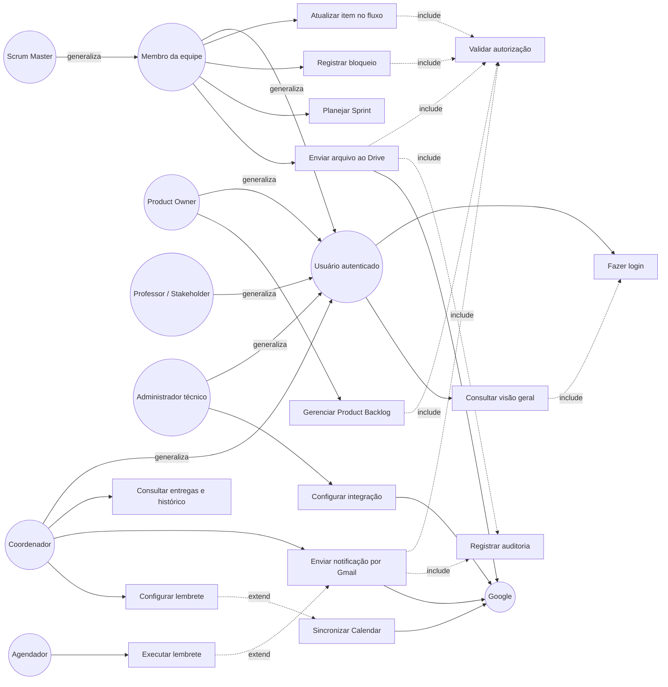

# Requisitos e Casos de Uso

**Projeto:** Sistema Web de Gestão Ágil do Projeto Acadêmico  
**Versão:** 1.0  
**Status:** proposta para validação

## 1. Objetivo

Este documento transforma a visão de produto e a especificação técnica em requisitos rastreáveis para o MVP. Ele é a origem dos casos de uso, da arquitetura e dos testes de aceitação.

O sistema atende um projeto acadêmico com oito pessoas organizadas em quatro duplas, um único Scrum Team, quatro frentes de trabalho, uma dupla de apoio de Gestão Ágil e coordenadores com visão ampliada.

## 2. Atores

| Ator | Descrição |
|---|---|
| Usuário autenticado | Pessoa identificada com acesso ao projeto |
| Membro da equipe | Participante que consulta e atualiza o trabalho permitido |
| Scrum Master | Pessoa formalmente responsável, por período, por apoiar transparência, inspeção, adaptação e facilitação |
| Coordenador | Superior dos membros, com visão ampliada do andamento e resultados |
| Product Owner | Pessoa única responsável por maximizar valor e ordenar o Product Backlog |
| Professor/Stakeholder | Acompanha resultados, prazos e entregas e fornece feedback |
| Administrador técnico | Configura autenticação, conexões e parâmetros de infraestrutura |
| Google | Sistema externo que fornece OAuth, Drive, Gmail e Calendar |
| Agendador | Ator temporal que dispara lembretes ou sincronizações habilitadas |

A dupla de Gestão Ágil é uma unidade de apoio organizacional. A responsabilidade formal de Scrum Master permanece individual e pode alternar entre seus integrantes.

## 3. Requisitos Funcionais

| ID | Requisito | Prioridade | Ator principal |
|---|---|---|---|
| RF01 | O sistema deve autenticar e identificar participantes autorizados do projeto. | Alta | Usuário autenticado |
| RF02 | O sistema deve exibir a visão geral com Sprint, metas, prazos, bloqueios, WIP e entregas recentes. | Alta | Membro da equipe |
| RF03 | O Product Owner deve criar, editar e ordenar itens do Product Backlog. | Alta | Product Owner |
| RF04 | A equipe deve selecionar itens para uma Sprint e manter o Sprint Backlog. | Alta | Membro da equipe |
| RF05 | O sistema deve registrar e consultar a Meta do Produto e a Meta da Sprint. | Alta | Product Owner |
| RF06 | Usuários autorizados devem atualizar o estado real dos itens no fluxo Kanban. | Alta | Membro da equipe |
| RF07 | O sistema deve impedir ou alertar movimentações que violem políticas e limites de WIP. | Alta | Scrum Master |
| RF08 | Usuários autorizados devem registrar, atualizar, resolver e consultar bloqueios. | Alta | Membro da equipe |
| RF09 | O sistema deve relacionar itens a frente, Sprint, responsáveis e entregas quando aplicável. | Alta | Membro da equipe |
| RF10 | O sistema deve registrar histórico de mudanças em itens, Sprints, fluxo, bloqueios e integrações. | Alta | Sistema |
| RF11 | Usuários autorizados devem consultar entregas por frente, Sprint, período e status. | Média | Coordenador |
| RF12 | O sistema deve enviar arquivos ao diretório Google Drive configurado. | Alta | Membro da equipe |
| RF13 | O sistema deve armazenar o vínculo e os metadados do arquivo sem duplicar seu conteúdo binário no banco. | Alta | Sistema |
| RF14 | Usuários autorizados devem redigir uma mensagem para destinatários do projeto. | Média | Coordenador |
| RF15 | O sistema deve enviar notificações autorizadas por Gmail e registrar seu resultado. | Média | Coordenador |
| RF16 | O sistema deve exibir sucesso, pendência ou falha de cada operação Google. | Alta | Usuário autenticado |
| RF17 | O sistema deve configurar lembretes de reuniões, prazos e eventos relevantes. | Média | Coordenador |
| RF18 | O sistema deve criar ou sincronizar eventos com Google Calendar quando habilitado. | Média | Coordenador |
| RF19 | O sistema deve manter a agenda interna quando Calendar estiver desabilitado ou indisponível. | Alta | Sistema |
| RF20 | O sistema deve distinguir a reunião de terça-feira da reunião principal de quarta-feira, ambas das 08:00 às 10:00 em dias não feriados. | Alta | Sistema |

## 4. Requisitos Não Funcionais

| ID | Categoria | Requisito verificável |
|---|---|---|
| RNF01 | Segurança | Tokens, segredos e credenciais Google não podem chegar ao navegador nem ser armazenados em texto puro. |
| RNF02 | Segurança | Toda escrita deve validar sessão, projeto, papel e autorização no servidor. |
| RNF03 | Privacidade | O sistema deve persistir apenas os dados Google necessários à finalidade autorizada. |
| RNF04 | Disponibilidade | Falha em Drive, Gmail ou Calendar não pode impedir consulta e atualização dos dados locais. |
| RNF05 | Confiabilidade | Upload, envio e sincronização devem possuir status explícito e comportamento idempotente quando aplicável. |
| RNF06 | Desempenho | A visão geral deve carregar os dados locais principais em até 2 segundos em condições normais de rede. |
| RNF07 | Usabilidade | O frontend deve indicar carregamento, vazio, sucesso, erro recuperável, pendência e acesso negado. |
| RNF08 | Acessibilidade | Telas principais devem ser navegáveis por teclado, ter foco visível, contraste adequado e rótulos acessíveis. |
| RNF09 | Manutenibilidade | Domínio e casos de uso não podem depender de React, Next.js, ORM ou SDK Google. |
| RNF10 | Auditoria | Alterações de permissão, fluxo, upload, envio e sincronização devem gerar evento auditável. |

## 5. Diagrama de Casos de Uso

`include` representa uma validação ou auditoria obrigatória para concluir o caso base. `extend` representa integração opcional ou acionada apenas quando Calendar está habilitado.

## 6. Casos de Uso Principais

### UC02 — Consultar visão geral

- **Ator:** usuário autenticado autorizado.
- **Pré-condição:** sessão válida e vínculo com o projeto.
- **Fluxo principal:** o sistema valida o acesso, consulta Sprint, metas, prazos, WIP, bloqueios e entregas e apresenta os dados locais.
- **Fluxo alternativo:** sem dados, a interface apresenta estado vazio; falha externa não bloqueia os dados locais.
- **Pós-condição:** nenhuma alteração persistente.

### UC03 — Atualizar item no fluxo

- **Ator:** membro da equipe ou Scrum Master.
- **Pré-condição:** item pertence ao projeto e o usuário possui autorização.
- **Fluxo principal:** usuário solicita movimentação; sistema valida política e WIP; grava novo estado e histórico; frontend confirma o resultado.
- **Fluxo alternativo:** limite ou política impedem a movimentação; sistema rejeita ou solicita confirmação conforme configuração.
- **Pós-condição:** estado atual e histórico permanecem consistentes.

### UC05 — Gerenciar Product Backlog

- **Ator:** Product Owner.
- **Pré-condição:** usuário possui a responsabilidade de Product Owner.
- **Fluxo principal:** criar, editar, priorizar e consultar itens.
- **Fluxo alternativo:** dados inválidos ou usuário sem permissão impedem a operação.
- **Pós-condição:** Product Backlog permanece ordenado e auditável.

### UC08 — Enviar arquivo ao Drive

- **Ator:** membro autorizado.
- **Pré-condição:** conexão Drive ativa, pasta configurada e arquivo dentro das políticas.
- **Fluxo principal:** sistema valida arquivo, envia para a pasta autorizada, salva vínculo e apresenta o link.
- **Fluxo alternativo:** conexão indisponível gera operação pendente ou falha recuperável sem corromper o item.
- **Pós-condição:** arquivo externo e metadados ficam vinculados ao item ou entrega.

### UC09 — Enviar notificação por Gmail

- **Ator:** coordenador ou papel autorizado.
- **Pré-condição:** conexão Gmail ativa e destinatários permitidos.
- **Fluxo principal:** usuário redige, revisa e confirma; sistema envia, registra status e audita a operação.
- **Fluxo alternativo:** falha ou ausência de conexão gera estado pendente/falha e permite nova tentativa controlada.
- **Pós-condição:** mensagem enviada ou registrada como não enviada.

### UC15 — Sincronizar Calendar

- **Ator:** coordenador ou agendador.
- **Pré-condição:** Calendar habilitado e calendário de destino definido.
- **Fluxo principal:** sistema cria ou atualiza evento e registra o identificador externo.
- **Fluxo alternativo:** integração desabilitada ou indisponível; agenda interna permanece funcional.
- **Pós-condição:** o evento local possui estado de sincronização conhecido.

## 7. Rastreabilidade Inicial

| Requisito | Caso de uso | Componente futuro de teste |
|---|---|---|
| RF01 | UC01 | autenticação e autorização |
| RF02 | UC02 | consulta de visão geral |
| RF03 | UC05 | Product Backlog |
| RF04-RF05 | UC06 | planejamento de Sprint |
| RF06-RF08 | UC03-UC04 | fluxo e bloqueios |
| RF10 | UC03, UC08, UC09 | auditoria e histórico |
| RF12-RF13 | UC08 | gateway Drive |
| RF14-RF16 | UC09 | gateway Gmail |
| RF17-RF20 | UC10, UC11, UC15 | agenda e Calendar |

Este documento deve ser atualizado quando os papéis, o fluxo real e as políticas de WIP forem validados com a equipe.
